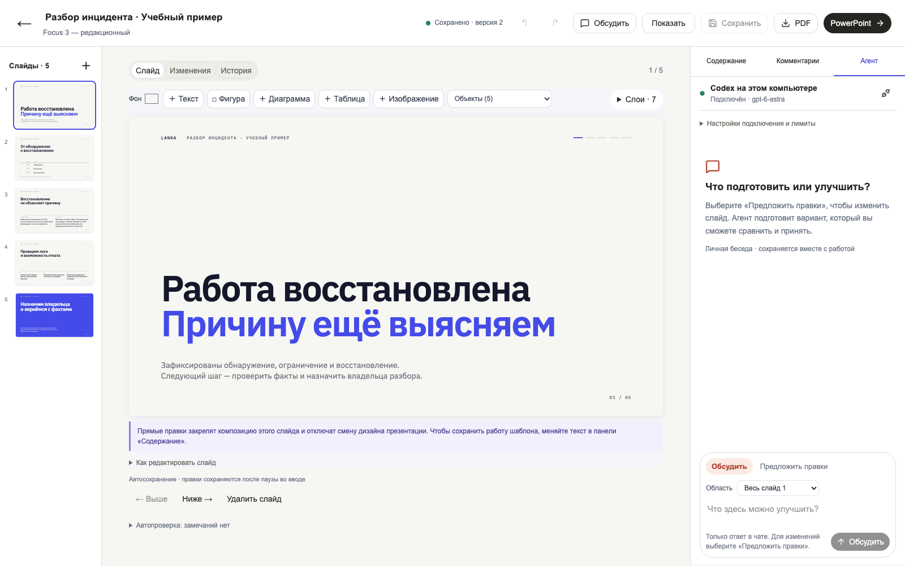
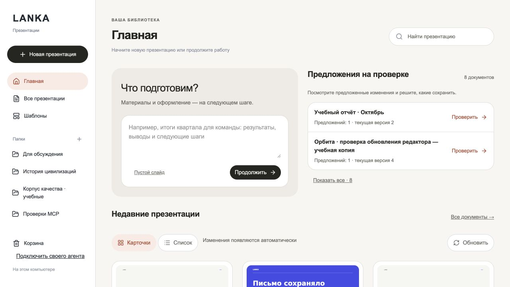
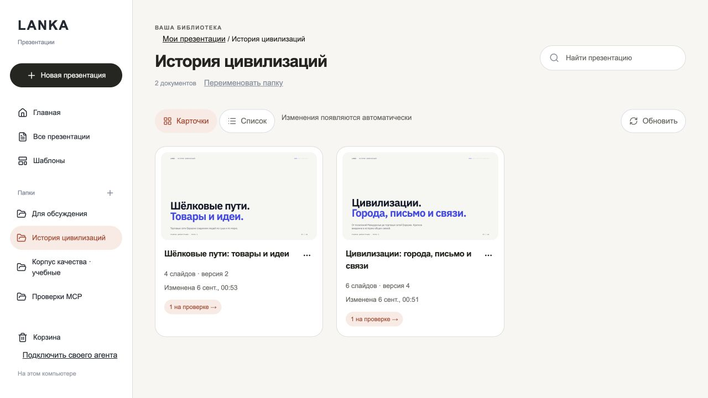
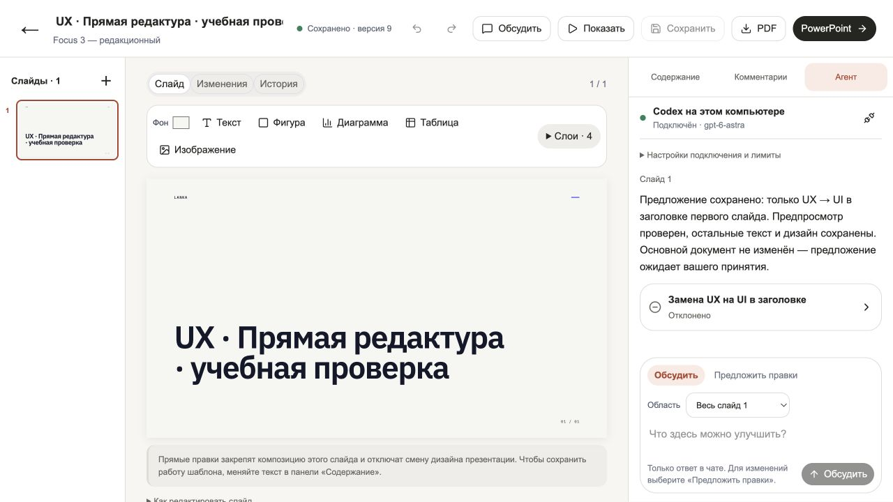

# Lanka

**Красивые презентации. Ваши AI-агенты. Внутри компании.**

Для команд, которые регулярно готовят предложения клиентам, отчёты и внутренние презентации. Подключите своего агента, опишите задачу и доработайте результат вместе с коллегами — прямо в браузере.



*Актуальный локальный интерфейс, 10 сентября 2026: учебная презентация и подключённый Codex. Снимок работающего приложения.*

## От задачи до презентации

1. **Подключите агента.** Codex, Claude Code или корпоративный агент с поддержкой MCP могут обращаться к инструментам Lanka. Для чата внутри редактора нужен совместимый адаптер; сейчас реализовано подключение Codex.
2. **Попросите подготовить слайды.** Шаблоны Focus задают типографику и композицию. Агент работает с содержанием и доступными ему материалами.
3. **Доведите результат вместе.** Редактируйте текст и объекты на слайде, обсуждайте с коллегами, просматривайте и принимайте предложения агента.
4. **Сохраните и поделитесь.** Документ остаётся в библиотеке с историей. При необходимости скачайте PDF или редактируемый PowerPoint.

## Для вашей команды

- **Дизайн с готовой основой.** Шаблоны и правила оформления помогают начать с продуманной композиции.
- **Свои агенты.** MCP позволяет встроить Lanka в выбранную компанией агентную платформу.
- **Общая библиотека.** Папки, поиск, комментарии и версии — чтобы находить и использовать работу коллег снова.
- **На своих серверах.** Корпоративный вход и права доступа. Компания выбирает, где хранятся документы и какие модели получают данные.

**Бесплатно, в том числе для компаний.** [Apache 2.0](LICENSE). Серверы и выбранные модели оплачиваются отдельно.

## Как выглядит Lanka

**Главная.** Начните презентацию с запроса или вернитесь к работе и предложениям на проверке.



**Папки.** Собирайте связанные презентации вместе, находите нужные материалы и открывайте правки на проверке.



**Чат с агентом.** Обсуждение рядом со слайдом, выбор области поручения и отдельные предложения правок. На снимке — сохранённая учебная беседа и отклонённое предложение.



## Попробовать локально

Нужны Node.js ≥22.13 и npm:

```sh
git clone https://github.com/artkruglov/lanka.git
cd lanka
npm ci
npm run build:mcp
node .project-runtime/web.mjs --workspace "$(pwd -P)/work/dev-library" --port 4321
```

Откройте [localhost:4321](http://127.0.0.1:4321). Это редактор с локальной библиотекой; подключение чата настраивается отдельно.

[Подключить Codex и чат](docs/LOCAL_CHAT_SETUP.md) · [Развернуть в компании](deploy/self-hosted/README.md) · [Разработка](CONTRIBUTING.md)

## Статус

**Public preview 0.10.0 — для знакомства и пилотов.** Совместимость каждого агента требует проверки. Полноценное одновременное редактирование и нагрузка тысяч пользователей пока не подтверждены. Закрытый контур требует внутренних моделей и соответствующих сетевых настроек. PPTX может отображаться иначе в PowerPoint.

[Что вошло в выпуск](RELEASE_NOTES.md) · [Подробности и сравнение подходов](docs/PRODUCT_OVERVIEW.md) · [Сторонние лицензии](THIRD_PARTY_NOTICES.md)

Хотите попробовать Lanka в своей команде? [Напишите автору в GitHub](https://github.com/artkruglov) или [откройте issue](https://github.com/artkruglov/lanka/issues) — без конфиденциальных материалов.
