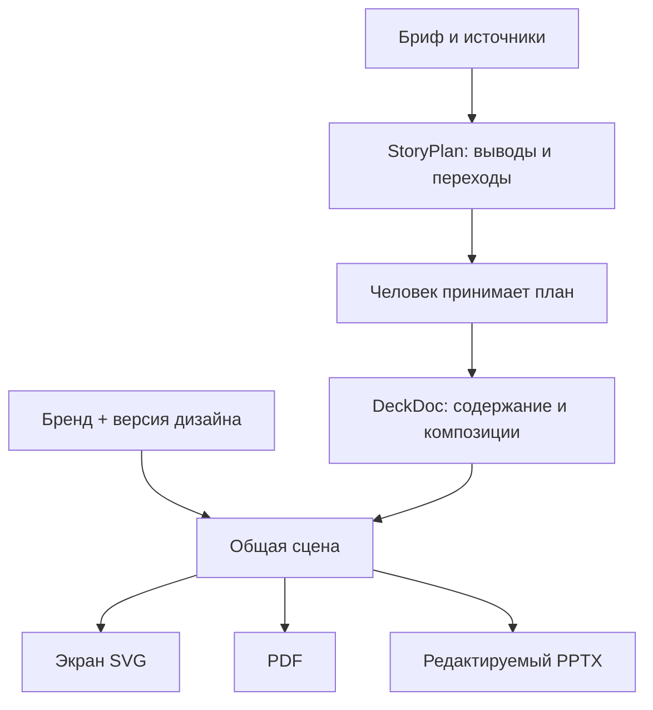

# Lanka 0.7: что уже даёт архитектура и где пока нет преимущества

5 сентября 2026. Сверка с PRD v1.2/v2.0 и фактическим кодом, а не описание предполагаемого продукта. Предыдущая матрица восьми проектов: [EDITOR_REUSE_REVIEW_V05.md](EDITOR_REUSE_REVIEW_V05.md).

## Сценарий отделён от исполнения

В подсистеме задач действительно есть самостоятельный `StoryPlan`. Это не только заголовки слайдов: план содержит ordered IDs, роль, вывод, переход, вопросы, источники и точные evidence locators. План принимается человеком до фазы `compose`. Проверка кандидата требует сохранить ID и порядок, принятые intent и ссылки на источники, бриф и бренд. Внешний агент не может сам принять план или выпуск.

В обычном `DeckDoc` бриф и intent хранятся вместе с содержимым слайдов; это структурное разделение внутри документа. Локальная папка пока не содержит машину состояний задач и независимое согласование StoryPlan. Новый `get_story` возвращает компактную проекцию сценария из основного документа и комментарии, а не создаёт вторую конкурирующую копию данных.



| Слой | Фактическая реализация | Что это даёт | Ограничение |
|---|---|---|---|
| Замысел | `lib/domain/narrative.ts`: audience, decision, keyMessage; role, takeaway, transition, openQuestions | Можно попросить агента изменить ход аргументации, сохранив оформление | Формальные проверки полноты не доказывают логику и правдивость |
| План задачи | `lib/domain/task.ts` и `lib/server/tasks.ts`: StoryPlan, story/compose, accept_plan, inspectCandidate | Компоновка не должна незаметно переписать уже согласованную историю | В локальный файловый сценарий план задач ещё не перенесён |
| Канонический документ | `lib/domain/model.ts`: Zod DeckDoc/Slide, стабильные IDs, данные и sourceIds | Агент читает понятные поля и меняет выбранный слайд | Это ограниченный JSON-формат, не полный язык произвольной композиции |
| Дизайн | `lib/domain/design.ts`: classic-v1 / atelier-v1; `atelier.ts` | Оформление выбирается независимо от содержания и палитры | Две встроенные системы по девять композиций, не готовый корпоративный BrandPack |
| Визуальная реализация | `scene.ts`: прямоугольники, текстовые строки и изображения, измеренные шрифты; `SlideCanvas` / `lib/export.ts` | Одна геометрия используется экраном, PDF и PPTX | Это собственная сцена, не DOM/CSS layout engine. Диаграммы экспортируются фигурами, не нативными PowerPoint chart objects |
| Совместная проверка | proposals, before/after, ревизии, выборочное принятие | Поздняя правка агента не должна затереть работу человека | Delta на уровне целого слайда, не CRDT и не посимвольное слияние |
| Папка клиента | ProjectStore + stdio MCP + локальный web editor | Человек и агент читают один project.json; есть обратная связь и принятие | Локальный lock не заменяет распределённый CAS или изоляцию ОС |

## Что взято из внешних проектов

| Проект | Реально в коде Lanka |
|---|---|
| CreatPPT | `parseBrief`, CANVAS, box, inset, canvasToInches. Не его полный редактор, compositional engine или библиотека профессиональных шаблонов |
| PptxGenJS | Реальный экспорт редактируемого текста, фигур и изображений в PPTX |
| pdf-lib / fontkit | Реальный PDF-экспорт и встраивание шрифтов |
| Codex | Официальный runtime в отдельной подсистеме, адаптер App Server. Наличие адаптера не означает настроенную модель |
| Presenton, PPTist, Univer, BlockSuite, Penpot, Touying | Изучались как архитектурные/продуктовые ориентиры; их код не является частью ядра |

Стек приложения — TypeScript/React/Vinext, хранение облачной версии D1/R2. Локальные MCP/редактор работают в Node; извлечение Office/PDF в отдельном worker использует Python/Poppler. Typst, Vue, CRDT-редакторы и универсальный Canvas engine в текущем продукте не интегрированы. Нельзя считать их возможности нашими.

## Почему агенту может быть удобнее, чем напрямую с PPTX

Преимущество — в предметном контракте и рабочем процессе. Агент получает задачу и инструменты `get_authoring_guide`, `get_story`, `get_project`, `propose_changes`, `lint_deck`, `export_deck`. Он может адресовать конкретный слайд, объяснить изменение, проверить доступность источника и получить конфликт версии. Ему не приходится каждый раз строить собственные сценарий, правила бренда, ревизии и review поверх итогового файла.

PPTX сам по себе не выражает наши поля «ожидаемое решение», «вывод читателя», «принятый сценарий» и workflow предложения. Эти данные можно организовать рядом с PPTX или в собственных расширениях — технического запрета нет. Наш продукт предоставляет готовую согласованную реализацию этих операций. Сам JSON не является уникальной технологией.

Для разовой презентации хороший агент с PptxGenJS/другим инструментом может оказаться проще и дать результат не хуже. Преимущество Lanka должно проявиться при повторных правках, работе команды и соблюдении бренда. Измеренного выигрыша в токенах, скорости или качестве пока нет: сравнение с прямым PPTX на одинаковом брифе ещё не проведено. Обратный импорт сложного отредактированного PPTX без потерь тоже не реализован.

## Почему прежний дизайн был слабым и что изменилось

Прежний выбор бренда менял преимущественно цвета. Девять фиксированных композиций повторяли похожую иерархию; это узкое место реализации, а не следствие разделения сценария и дизайна.

В 0.7 добавлен самостоятельный Atelier v1: более крупная типографика, тёмные открытие/финал, отдельный силуэт для ключевого вывода, асимметричный текстовый слайд, выраженные числовые акценты, горизонтальная диаграмма и последовательность шагов. Он применяется к тому же содержанию и к тому же бренду. Изменение дизайна сохраняется в документе и экспортируется. Документы без `design` продолжают использовать Classic v1; новые задачи, Markdown-презентации и демо получают Atelier v1. Кандидат задачи должен сохранить выбранную версию дизайна. Версия дизайна входит в JSON, поэтому старый документ не меняется молча при обновлении приложения.

Это первый улучшенный набор, а не основание объявлять качество «вау» доказанным. Следующий качественный скачок: настоящий бренд клиента, 20–30 тщательно подготовленных эталонных слайдов, композиции на основе смысла данных, управление изображениями и цикл render → visual critique → correction. Оценку проводит дизайнер и пользователь на реальных материалах.

Полноценный Brand Onboarding из исходного замысла остаётся отдельной подсистемой: агент разбирает бренд-материалы и предлагает систему; интегратор/Brand Admin проверяет и сертифицирует. Агент не сертифицирует себя. Текущие name/version/colors/status — лишь заготовка для BrandPack, без полноценной иерархии masters/layouts, логотипов, лицензионной политики шрифтов и автоматического онбординга.

## Локальный проект: уже без обмена ZIP на каждом шаге

После `npm ci` и `npm run build:mcp`:

```sh
npm run start:project -- --root /ABS/CLIENT/PROJECT
codex mcp add lanka-project -- node /ABS/LANKA/.project-runtime/server.mjs --root /ABS/CLIENT/PROJECT
```

Первую команду запускают из checkout Lanka; `--root` — существующая реальная папка проекта. Редактор выводит свой адрес и слушает только `127.0.0.1`. Вторая команда подключает отдельно авторизованный локальный Codex к той же папке. В проекте может быть существующий `project.json` из ZIP либо новая презентация. Веб-Codex не читает локальную конфигурацию автоматически.

Рабочий цикл: создать → выбрать дизайн → редактировать справа → **Сохранить** → оставить замечание слева → агент читает `get_story` → `propose_changes` → человек смотрит before/after и принимает → экспортирует. UI перечитывает состояние каждые 2,5 секунды и не заменяет несохранённый ввод. Запись явная, с проверкой ревизии. Локальные изменения сразу попадают в авторитетный `project.json`; `presentation/deck.json` внутри старого ZIP остаётся снимком и не обновляется автоматически.

Доступ сотрудников через корпоративный диск, распределённая синхронизация, отдельные контейнеры клиента и миграция облачного редактора на клиентский storage adapter пока не сделаны. Локальная страница — инструмент владельца папки на его машине, без пользователей/приглашений/удалённого доступа. Ограничения папки не ограничивают другие инструменты агента, доступные его ОС-пользователю. Закрытый облачный пилот сохраняет D1/R2 и отдельный контур данных.

## Приёмка 0.7

Проверены сохранение человеком → чтение реальным stdio MCP → комментарий → предложение → принятие человеком → повторное чтение project.json; сохранность источников, ревизии и review; отказ чужому документу, stale save, запросам без сессии/Origin, подменённому Host, произвольным путям. Встроенных возможностей публикации у локального агента нет.

Дизайн проверяется на всех девяти fixture-композициях; переключение не изменяет сценарий, неизвестная версия отвергается, слишком плотный текст блокирует экспорт. Демонстрационный семислайдовый проект экспортирован через реальный MCP в Atelier. Проверка отдельной авторизованной модели и hosted MCP не подменяется этой демонстрацией.
