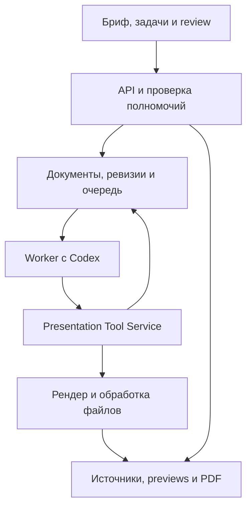

# Lanka Studio: что осталось реализовать и как перейти к Codex внутри продукта

> Уточнение 0.3: актуальный чертёж и новые решения — [PRODUCT_BLUEPRINT_V3.md](PRODUCT_BLUEPRINT_V3.md). Inline-редактирование исключено. Таблицы ниже фиксируют аудит 0.2; текущая реализация добавляет бриф/intent, карту логики, визуальный review, отдельную корректировку и каталог девяти композиций. Полноценный Codex pipeline всё ещё отсутствует.

Дата: 5 сентября 2026. Аудит опубликованной исходной базы 0.2 и уточнения пользователя. Это оценка по PRD и коду, без браузерной UX-приёмки и без запуска настоящего Codex на целевом сервере.

## Вывод

Готов рабочий прототип редактора и нескольких механизмов контроля изменений. Основной продуктовый сценарий ещё не реализован. Установка Codex закрывает агентный runtime, но сама по себе не создаёт корпоративные шаблоны, извлечение источников, серверный рендер, рабочий каталог, полномочия и экран согласования.

Целевая конструкция: пользователь ставит задачу в Lanka Studio, установленный Codex выполняет её в изолированной среде, сервис выдаёт разрешённые материалы и инструменты, сохраняет предложения, показывает результат и проводит человеческое согласование. Адаптер одного Chat Completions запроса не является основной дорогой развития.

Документы v1.2 и v2.0 содержат пересекающиеся требования: v2 явно заменяет v1.0/1.1, но не оговаривает v1.2. Для этой оценки использованы пользовательский приоритет готового агента, сценарий v2 §1.5 и дополнительные требования Brand Onboarding v1.2. Ни один исходный PRD не изменён; сокращённое описание v2 не считается отменой Brand Onboarding. Полная построчная карта v2 §10 и Brand/Onboarding v1.2 §8.5–8.6 находится в REQUIREMENTS_MATRIX.md.

## Что сохраняем и что меняем

| Область | Что уже есть | Что мешает полному сценарию |
|---|---|---|
| Создание | Markdown/JSON, семь фиксированных композиций | Пользователь сам приносит структуру; нет брифа, аудитории, режима выступления и подготовки по нескольким файлам |
| Документ | Типизированный JSON, ID слайдов, ревизии, CAS | Нет универсальных стабильных блоков, candidate revision, адресных операций, происхождения производных дек |
| Агент | Один запрос модели для замены существующих слайдов, записи запусков | Нет Codex процесса, workspace, навыков, tool loop, вопросов, продолжения и восстановления |
| Задачи | Статусы, отмена, лимиты попыток, идемпотентность | Это HTTP-выполнение с истечением срока; нет фоновой очереди, heartbeat, checkpoint, DLQ и событий этапов |
| Инструменты | Семь MCP tools, общий серверный command service, файловый пакет | Нет scoped OAuth/agent principal, checkout CLI, template contract, render/images/source tools; внешние записи не образуют полноценные AgentRun |
| Review | Текстовое «было/стало», принятие целых слайдов, проверка конфликтов | Нет визуального сравнения и категорий данных/источников, зависимых групп, комментариев к блокам и замкнутой доработки агентом |
| Бренд | Набор цветов/подпись, ручная отметка certified | Нет настоящего Brand Pack, шрифтов/recipes/guide, evidence, fixtures и Brand Admin certification |
| Источники | Текст, CSV, PNG/JPEG, хеши файлов | Нет нормализации PDF/DOCX/PPTX/XLSX, ссылок на страницы/ячейки, дат/единиц и отчёта извлечения |
| Изображения | Загрузка и показ готовой картинки | Нет поиска по Brand Library, генерации кандидатов, image broker, style policy и полного provenance |
| Рендер | Общая геометрия SVG/PDF/PPTX, базовый overflow | Агент не получает серверные изображения; нет закреплённого изолированного renderer и repair/vision цикла |
| Выпуск | Утверждение версии и immutable JSON release | PDF создаётся в браузере; нет сохранённого PDF/manifest, требуемых согласующих и отдельного Publisher |
| Организация | Доступ по email и роли документа за Site identity | Нет tenant/workspace/OIDC, отдельной identity агента, политик классификации, промышленного аудита |
| Качество | 33 теста механизмов и сборка | Нет evals реальных агентных задач, двух сертифицированных корпоративных пакетов, сквозной приёмки и эксплуатационных испытаний |

Тесты подтвердили полезные гарантии: повтор команды не дублирует изменение, отменённый запуск не записывает позднее предложение, старая ревизия не затирает новую. Эти механизмы нужно перенести в новую архитектуру. Количество тестов не является процентом готовности продукта.

Во время аудита найден и исправлен дефект описания MCP `propose_changes`: requestId ошибочно требовался внутри каждого элемента changes, хотя не был там разрешён. Теперь ключ требуется на уровне всей команды; проверка обнаружения инструментов проверяет согласованность required/properties.

## Подходит ли интерфейс для пользовательских задач

Для ручной корректировки готовой презентации — частично подходит. Для полного цикла поручения агенту — пока нет. Это вывод из текущих экранов в коде и UX-контракта PRD §9, а не результат проведённого пользовательского тестирования.

| Работа пользователя | Текущий путь | Требуемый путь |
|---|---|---|
| Подготовить презентацию из материалов | Внести готовый Markdown и затем открыть панель агента | Создать задачу, приложить файлы, выбрать аудиторию и бренд, получить черновик |
| Понять, что делает агент | Небольшая история последних запусков | План, текущий этап, источники, вопросы, промежуточные страницы и причины остановки |
| Уточнить задание | Новый текст после завершения/отмены | Ответить на вопрос, добавить ограничение, продолжить ту же задачу с сохранённым контекстом |
| Проверить результат | Текстовый diff в узкой панели | Сетка страниц и before/after, изменения цифр/источников/визуалов, блокирующие замечания |
| Попросить доработку | Комментарий и отдельно сформулированная команда | Назначить комментарии агенту; получить связанное предложение и видеть, какие замечания закрыты |
| Обновить прошлый отчёт | Клонировать и править вручную | Прошлый выпуск + новый snapshot → производный черновик с происхождением и meaningful diff |
| Подключить бренд компании | Задать несколько цветов | Материалы бренда → кандидаты и конфликты → тестовые слайды → сертификация человеком |

Нужны четыре основные рабочие поверхности:

1. **Рабочее пространство.** Создать с агентом, активные задачи, ожидают моего ответа, ожидают проверки, последние выпуски. Один проект может содержать много презентаций и задач.
2. **Постановка задачи.** Цель, аудитория, ожидаемое решение, язык, standalone/speaker-led, материалы и прошлый выпуск, сертифицированный Brand Pack. Значения по умолчанию сокращают форму; только блокирующие вопросы останавливают выполнение.
3. **Выполнение.** Слева план и этапы; в центре промежуточные слайды/результаты; справа вопросы, источники и действия. Кнопки ответить, дополнить задачу, отменить, открыть готовое предложение. Показывать выполненные операции и краткое объяснение, без скрытого хода рассуждений модели.
4. **Проверка.** Сетка слайдов, выбранная страница, сравнение до/после, категории изменений, источники, проблемы и комментарии. Принять независимую группу, отклонить, попросить доработку или предложить точную замену в отдельной форме. Выпуск доступен отдельной роли после согласования.

Текущий редактор, slide rail, просмотр источников и история остаются частью четвёртой поверхности. Список технических worker jobs не должен становиться основным интерфейсом автора.

## Codex как готовый исполнитель

Официальный App Server предназначен для встраивания Codex в продукт и даёт историю, аутентификацию, согласования и поток событий. Для интерактивного сценария выбираем его за нашим адаптером; для отдельных полностью автоматических задач подходит Codex SDK. Предпочтительный внутренний транспорт адаптера — stdio; браузер взаимодействует с API Lanka, а не с открытым App Server. [OpenAI App Server](https://learn.chatgpt.com/docs/app-server), [Codex SDK](https://learn.chatgpt.com/docs/codex-sdk).

Установка runtime не означает локальную установку весов OpenAI и не переносит сюда возможности текущей Work-сессии автоматически. Нужны отдельная разрешённая аутентификация и доступ к inference. Официальная документация рекомендует API key для программных запусков; также описывает Codex access tokens для разрешённой Enterprise-автоматизации. Конкретная схема зависит от аккаунта и доступных прав. Общую пользовательскую сессию не передаём всему сервису. [Аутентификация Codex](https://learn.chatgpt.com/docs/auth).

Предлагаемые границы интеграции:

- `CodexRuntimeAdapter` отвечает за старт/продолжение, идентификаторы thread/turn, события и прерывание. Остальной domain не зависит от названий событий Codex.
- `PresentationTask` хранит намерение пользователя; несколько `AgentRun` могут быть попытками/итерациями этой задачи. `WorkerJob` описывает конкретное техническое выполнение. Ни один из этих ID не подменяется идентификатором Codex thread.
- Каждый run закрепляет base revision, версии навыков/шаблона, разрешённые источники и бюджеты. Рабочий каталог содержит только разрешённую проекцию документов, данные и previews.
- Навыки `deck-prep`, `deck-render`, `deck-visuals` объясняют workflow. Права и валидность проверяет Tool Service. Codex может использовать код в sandbox для подготовки, но не получает доступ к БД, чужим источникам, контейнерному сокету или публикации.
- Агент создаёт proposal/candidate revision. Даже первый greenfield deck не должен превращать каждую промежуточную правку в человеческую main revision.
- Вопрос пользователю — сохраняемый объект с ID, контекстом и ответом. Browser reconnect не теряет вопрос. Ответ продолжает задачу, а не создаёт несвязанную генерацию.
- Лизинг worker, heartbeat, checkpoints и outbox нужны поверх runtime. Повтор доставки задания и перезапуск процесса не должны повторно списывать генерацию картинки или повторно применять команду.
- Отмена сначала отзывает право записи результата, затем прерывает runtime. Старый процесс не может завершить задачу после передачи lease другому worker. Гарантия отсутствия поздней записи и прекращение внешнего биллинга — разные вещи.
- Runtime thread/session-файлы храним изолированно и восстанавливаем вместе с проверенным checkpoint. Одного thread ID после потери диска недостаточно. История продукта и результаты tools остаются в нашей БД/хранилище.

## Полный сценарий, который доказывает продукт

Сценарий основан на v2 §1.5 и дополнительных требованиях к Brand Pack из v1.2.

1. Интегратор и дизайнер готовят реальный Brand Pack из брендбука, логотипов, шрифтов и референсов. Кандидаты имеют evidence/authority; человек разрешает конфликты. Fixtures и тестовая дека проходят; Brand Admin сертифицирует release.
2. Автор ставит задачу: подготовить десять слайдов для совета директоров. Прикладывает три источника, выбирает standalone и сертифицированный бренд.
3. Сервис извлекает материалы и показывает неполные/неудачные извлечения. Codex задаёт до двух действительно блокирующих вопросов, готовит карту источников и структуру.
4. Codex собирает semantic blocks в candidate revision, связывает цифры с источниками/датами и выбирает разрешённые recipes. Критический неподтверждённый факт переводит задачу в ожидание ответа.
5. Для визуалов сначала ищутся корпоративные ассеты и структурные формы, затем при разрешённой политике image broker создаёт кандидаты. Выбранный результат закрепляется по хешу.
6. Сервер рендерит страницы, возвращает измеренные проблемы. Codex исправляет минимум три заранее внесённых нарушения ограниченным repair loop. Финальная проверка рассматривает весь deck.
7. Автор получает десять previews, предложение и отчёт: источники, непроверенные утверждения, устаревшие данные, сгенерированные изображения, оставшиеся вопросы.
8. Автор пишет четыре комментария к блокам; Codex готовит связанную доработку. Автор частично принимает изменения, одно отклоняет и одну формулировку исправляет вручную.
9. Reviewer подтверждает содержание; отдельный Publisher выпускает эту ревизию. Сервер повторяет preflight и сохраняет PDF + manifest с версиями бренда/навыков/рендера, хешами данных/ассетов и согласованиями.
10. Внешний Codex через MCP/CLI выполняет ту же логическую работу с теми же domain objects и проверками прав. Отзыв его полномочий прекращает новые операции.
11. Новые данные следующего месяца создают производный черновик; старый опубликованный PDF не меняется.

Первую демонстрацию на одном подготовленном шаблоне можно сделать раньше полного onboarding. Это первый этап разработки, а не снятие Brand Onboarding и второго корпоративного шаблона с P0-приёмки.

## Размещение

Предпочтение для ближайшего пилота: использовать уже освоенное внешнее облако проекта `shop reuse app`, если там есть долгоживущие контейнеры/VM, постоянные данные, секреты и разрешённый доступ к выбранному агенту. Это снижает объём новой инфраструктурной работы. Название провайдера, проект, регион и доступы в текущей среде не установлены: папка `hills` и её deployment-конфигурация не найдены в доступных материалах; поиск истории не дал результата. Новый облачный проект пока не создавался.

| Вариант | Когда выбирать | Что потребуется |
|---|---|---|
| Уже используемое внешнее облако | Быстро доказать полный сценарий на разрешённых материалах | Проверить поддержку worker, хранения, OIDC, сети, секретов и изоляции; повторно использовать способ сборки/деплоя |
| Яндекс Облако | Основной заказчик требует соответствующий контур хранения и эксплуатации | Compute VM/контейнеры, PostgreSQL, Object Storage; отдельно разрешённая схема inference |
| Существующий Site + внешний worker | Короткий переходный этап | Worker обращается к узкому HTTPS Tool API с отдельной identity; не получает полный browser session |

Для YC предлагаю обычную VM с контейнерами для первого пилота; Kubernetes можно добавить по реальной потребности. Это инженерный выбор ради простоты процессов, изоляции и диагностики, а не утверждение, что serverless не поддерживает долгие задачи. Текущая документация Serverless Containers указывает long-lived режим с обработкой до часа, но очередь, checkpoints, рабочие каталоги и восстановление всё равно остаются нашей ответственностью. [Compute VM](https://yandex.cloud/en/docs/compute/concepts/vm), [лимиты Serverless Containers](https://yandex.cloud/en/docs/serverless-containers/concepts/limits).

Хранение документов в России не делает обработку внешним Codex локальной. России нет в опубликованном списке поддерживаемых стран OpenAI API; нельзя считать, что зарубежный сервер автоматически решает вопрос допустимости доступа организации и пользователей. Для выбранной схемы отдельно проверяются доступность аккаунта/пользователей и разрешённая передача данных. Если организация требует полностью закрытую обработку, нужен одобренный ею runtime/provider; это отдельное решение, а не неявная подмена Codex. [Поддерживаемые страны OpenAI API](https://developers.openai.com/api/docs/supported-countries).

Целевая переносимая конфигурация: Node API/React, PostgreSQL, S3-compatible storage, durable queue, worker-agent, worker-render, worker-assets. В YC доступны управляемые [PostgreSQL](https://yandex.cloud/en/docs/managed-postgresql/concepts/) и [Object Storage](https://yandex.cloud/en/docs/storage/concepts/). Стартовая гипотеза для небольшого пилота — 4–8 vCPU и 16 GB RAM при 1–2 одновременно работающих агентах и отдельном лимите рендера; это оценка для нагрузочной проверки, не измеренная ёмкость. GPU не нужен, если inference внешний.

Это топология целевого решения. Очередь может быть на PostgreSQL или на стандартном сервисе выбранного облака; критичны delivery semantics, leases и атомарность с outbox. Не нужно внедрять несколько новых сервисов очередей одновременно.

## Что нужно для переноса текущего приложения

Текущий Site нельзя перенести в VM одной копией архива: код использует `cloudflare:workers`, D1/R2 и доверенные identity headers хостинга.

1. Выделить portable domain/commands из Cloudflare adapters. React-компоненты и схемы переиспользовать.
2. Добавить PostgreSQL repository и S3 blob adapter; сохранить CAS, receipts, cancellation fence и immutable snapshots в настоящих транзакциях.
3. Ввести собственную OIDC/session проверку, tenant/workspace и отдельные agent credentials. Не доверять присланным из интернета `oai-authenticated-user-*` headers.
4. Добавить изолированные workers, долговечную очередь, Event API с возобновлением по cursor и хранилище результатов.
5. Подготовить контейнеры, health/readiness, миграции, секреты, метрики и backup/restore. Не выдавать агентному sandbox инфраструктурные секреты.
6. Если в Site есть нужные данные, сделать read-only inventory/export, сохранить IDs/связи/блоб-хеши, проверить импорт и права. Перед переключением — согласовать окно записи, чтобы две установки не принимали расходящиеся изменения.
7. Пройти обязательную демонстрацию на staging, затем переносить пользовательский трафик. До выбора конкретного проекта нельзя утверждать, что внешнее размещение выполнено.

## Порядок разработки с проверяемыми выходами

| Этап | Работа | Условие завершения |
|---|---|---|
| A | Выбор существующего окружения, portable API, auth, DB/storage, Codex worker | Из интерфейса запускается Codex; после перезагрузки страницы видны тот же run и вопрос; агент не может вызвать publish |
| B | Semantic blocks/candidate revision, projection/CLI, Tool Service, один Brand Pack | Агент создаёт и изменяет весь deck через разрешённые команды, видит изображения своего результата; main не меняется |
| C | Brief/source intake, три навыка, image broker, render/repair | Три файла превращаются в десять слайдов; недоказанные данные вызывают вопрос; внесённые layout-проблемы исправляются |
| D | Run workspace, visual/semantic review, comments→delta, роли выпуска | Четыре комментария приводят к связанному proposal; частичное принятие сохраняет согласованность; PDF/manifest неизменяемы |
| E | Полный Brand Onboarding, второй бренд, data lineage, evals и эксплуатация | Проходят требования P0 и две корпоративные дизайн-системы; подтверждены restore, revoke, сбои worker/provider и качество на корпусе |

Преждевременно расширять PPTX, свободный canvas или добавлять декоративные экраны до этапа D. Трудоёмкость не оценивается по числу закрытых строк: очереди, auth и rendering дают больше зависимостей, чем отдельные кнопки. Оценка календаря станет надёжной после первого реального прохода Codex и проверки существующего окружения.

## Переиспользование open source

Главное переиспользование в следующем этапе — готовый runtime Codex. Его планирование, tool loop и ведение сессии не переписываем. Presentation tools, права, документ и review остаются нашим продуктом.

CreatPPT уже используется в intake/геометрии. Из его подхода и Presenton полезно переиспользовать подходящие модули подготовки материалов и рабочие сценарии после проверки точного кода/версии. Официальный MCP SDK нужен вместо расширения самописного транспорта. Для авторитетного рендера PRD выбирает закреплённые Chromium/Playwright; существующий PPTX экспорт сохраняется за адаптером. В этом аудите новые upstream-модули не импортированы и свежая лицензионная проверка их кода не заявляется выполненной.
