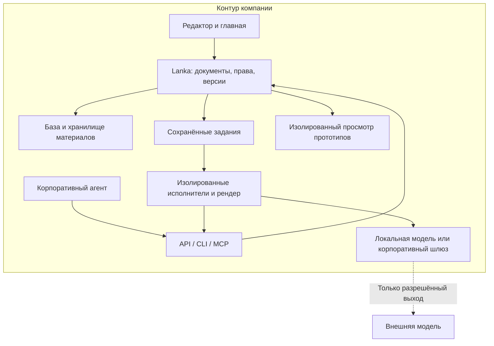

# Lanka: открытая среда для визуальных материалов и агентов

6 сентября 2026. Горизонт рассуждения — сентябрь 2027. Требование владельца: открытый продукт, который компания разворачивает у себя; материалы, обсуждения и доступ остаются под её контролем. Быстрое создание красивых презентаций и удобная правка остаются первым обязательным результатом.

Это продуктовая и архитектурная рекомендация, не описание уже готовой поставки. Ускорение агентов — сценарное предположение. Возможность работы с интерактивными отчётами и прототипами закладывается как расширение; конкретный второй тип материала выбирается по задачам пилота. Документ дополняет [PRODUCT_DIRECTION.md](PRODUCT_DIRECTION.md) и уточняет требования к размещению и развитию ядра. Он не объявляет автоматическую миграцию существующего приложения или публикацию исходного кода.

Направление детализировано в [пакете разработки](planning/README.md): пользовательские истории, сверка невыполненных требований, архитектура/БД/MCP, контракт UI-чата со своим агентом и 28 пакетов работ. Он задаёт текущую последовательность и проверяемые границы; годовой горизонт ниже остаётся гипотезой развития.

## 1. Что должно оставаться ценным при сильных агентах

**Lanka — место, где компания превращает работу людей и разных агентов в красивые, пригодные для использования материалы и сохраняет возможность развивать их дальше.** Презентация — первый тип такого материала. Содержание, исходники, данные, комментарии и версия результата принадлежат компании; исполнитель сменяем.

Уже сейчас [Claude Artifacts](https://claude.com/blog/build-artifacts) предлагает создание, просмотр, изменение и передачу интерактивных приложений; обновление официального описания от 21 октября 2025 добавляет MCP и постоянное хранение. [Open WebUI](https://docs.openwebui.com/) документирует самостоятельное размещение, работу с локальными и облачными моделями и offline-режим. Наличие чата, HTML-превью, папок или self-hosted установки само по себе не доказывает преимущество Lanka. Здесь проверена документация, не сравнительное качество этих продуктов.

Рабочая гипотеза преимущества Lanka: меньше времени до сильного визуального результата в стиле компании, меньше ручной доводки, корректное повторное использование её материалов и понятное совместное продолжение работы. Это нужно проверять против привычного инструмента команды и её текущего агента. Контроль инфраструктуры — обязательное условие выбранного продукта; за ним должна стоять повседневная польза.

| Если через год… | Что агент делает лучше | Что должна давать Lanka |
|---|---|---|
| Генерация по короткому запросу стала гораздо лучше | Сценарий, вёрстка, изображения, несколько вариантов | Доступные материалы компании, правила бренда, критерии качества и быстрый путь к завершению |
| Агент уверенно редактирует код и интерфейсы | Создаёт новые композиции и интерактивные элементы | Рабочая копия, безопасное выполнение, просмотр результата и сохранённые исходники |
| Пользователь меняет модель или агентный продукт | Новый исполнитель продолжает задачу | Переносимые документы, принятые решения, комментарии и результаты проверок вне истории чата |
| Большая часть правок делается словами | Обновляет нужные части по замечанию | Видимое до/после, точная область изменения, быстрая ручная доводка и восстановление |

Если прогресс будет медленнее, библиотека компонентов и прямой редактор сохраняют полезность. Если агенты быстро освоят новые композиции, среда позволяет добавлять их без замены документа и всей истории. Не нужно заранее выбирать одну скорость развития моделей.

## 2. Как выглядит продукт для человека

Главная показывает доступные работы команды, подборки, сохранённые примеры и недавние документы. Можно посмотреть, поставить лайк, обсудить и создать свою версию. Публичный каталог не является обязательным внешним сервисом: корпоративная установка может работать только с внутренними материалами и установленными пакетами примеров.

В папке проекта лежат презентация, исходное исследование и, позднее, интерактивное приложение или прототип. У каждого материала есть владелец, версии, обсуждение, источник и понятные действия просмотра/редактирования/передачи. Слово «артефакт» не обязательно показывать пользователю: в интерфейсе это «Презентация», «Отчёт», «Прототип».

Пример будущего рабочего цикла:

1. Менеджер поручает подготовить презентацию под клиента из утверждённых кейсов и данных компании.
2. Агент создаёт личный черновик, проверяет вёрстку и показывает результат. Человек редактирует пару формулировок.
3. Коллега оставляет замечание на слайде. Агент предлагает точечное изменение, автор принимает его.
4. Для той же встречи создаётся интерактивный расчёт на тех же разрешённых исходных данных. Это отдельный материал проекта с собственной версией.
5. Коллеге открывают внутреннюю ссылку на нужные версии. Для клиента при необходимости создают отдельную разрешённую передачу или экспорт.
6. Через месяц другой агент получает сохранённое состояние проекта и обновляет материалы. Он видит принятые решения и факты, а не вынужден восстанавливать их из случайного старого чата.

Встроенный чат и внешний корпоративный агент — равноправные способы работы. Пользователь может вообще начать из своего агентного приложения; Lanka возвращает ссылку на результат, который удобно посмотреть и обсудить. Обязательный собственный универсальный чат не должен становиться условием доступа к документам.

## 3. Среда, которая нужна агенту

| Потребность | Контракт Lanka | Проверка |
|---|---|---|
| Понять задание | Цель, аудитория, выбранная версия, разрешённые материалы, бренд и ограничения | Новый исполнитель понимает, что меняется, без полного журнала первого агента |
| Найти материал | Поиск и чтение с проверкой прав; ссылки на конкретные снимки данных | Недоступные файлы, превью и метаданные не попадают в ответы |
| Работать с исходниками | Проверяемая рабочая копия документа/пакета, описание схемы и доступных операций | Изменение копии не портит опубликованную версию |
| Видеть результат | Рендер, превью, снимок, ошибки исполнения, переполнения и проверки объектов | Агент исправляет реальную ошибку, а не только заявляет, что всё проверил |
| Сделать точечную правку | Стабильные ID для структуры, file patch для разрешённого кода; базовая версия | Ручное изменение соседнего блока сохраняется; конфликт в том же блоке виден |
| Продолжить долгую работу | Сохранённое задание, прогресс, checkpoints, ограничение попыток/времени, отмена | Закрытие браузера и перезапуск worker не теряют задачу и не дублируют запись |
| Передать работу | Снимок результата, список решений, незавершённые замечания и отчёт проверки | Второй независимый адаптер продолжает ту же работу |
| Дать результат человеку | Превью кандидата, понятное сравнение, принятие/отмена, ссылка на версию | Пользователь видит именно принятый результат |

Для этого нужны единые продуктовые операции, доступные через API, CLI и MCP. Это интерфейсы одного сервиса, а не три независимо реализованных хранилища. Машинный клиент получает структурированные результаты, идентификаторы и адресуемые ошибки; ему не требуется имитировать клики там, где доступна операция сервиса.

Пример групп операций для проектирования: обнаружение возможностей; поиск/чтение; создание рабочей копии; patch/validate/render; предложение; состояние/отмена задания; передача результата. Окончательные имена и схемы фиксируются при реализации. Сервер самостоятельно проверяет права, версию и качество обязательных контрактов. Самоотчёт агента «проверено» не заменяет результат исполнения проверяющего сервиса.

MCP Tasks в спецификации [2025-11-25](https://modelcontextprotocol.io/specification/2025-11-25/basic/utilities/tasks) описывает отложенное получение результата и состояние задачи, но обозначен experimental. Состояние заданий Lanka остаётся своим устойчивым контрактом; протокол подключается адаптером после согласования возможностей клиента. Проверка только одного модельного SDK недостаточна для обещания сменяемого агента.

Checkpoint хранит краткие принятые решения, ссылки на файлы/версии, незавершённые действия и подтверждённые результаты проверок. Не требуется сохранять или передавать скрытые рассуждения модели. Несколько агентов при необходимости работают в отдельных копиях; объединение проверяет общие факты и конфликтующие изменения. Специальную многоагентную систему до такого спроса строить не требуется.

## 4. Два режима содержания и свобода дизайна

**Презентация** остаётся структурированным документом с текстом, изображениями, данными и устойчивыми блоками. HTML/CSS/SVG отвечают за отображение и ввод, а общий план размещения — за согласованный вид и экспорт. Это позволяет человеку исправить текст или число без генерации нового кода. Существующие Focus 1/2/3 и DeckDoc не мигрируют массово.

**Интерактивный материал** может хранить исходный HTML/CSS/JS, данные и собранную версию. Он получает просмотр, версии, комментарии и исполнение в отдельной среде. Для произвольного HTML не обещается полная редактируемость в PPTX; снимок или PDF также не сохраняют интерактивность. Полноценные приложения с постоянно работающим backend, произвольной базой и внешними транзакциями — отдельный класс размещения, не первый прототипный режим.

Сильного агента не нужно навсегда ограничивать выбором из фиксированного каталога. Он может создать новый компонент или вариант оформления в рабочей копии, собрать его, посмотреть и приложить проверки. Первое использование получает честные возможности редактирования/экспорта. В общую библиотеку компании компонент попадает как отдельная принятая версия. Установка пакета не выполняет его код внутри доверенного сервера редактора.

В ближайшей реализации обычная документная сессия работает с установленными компонентами, как описано в техническом плане. Создание компонентов агентом — следующий контролируемый путь развития. Так шаблоны дают качество сейчас и становятся переиспользуемым материалом для более сильных агентов в будущем.

Над типами нужен небольшой общий слой: материал, версия, разрешения, комментарии, исходные зависимости, превью и возможности экспорта. Не нужно сразу превращать DeckDoc в универсальный JSON для всего. Выделение расширяемого интерфейса типа материала проверяется на втором реальном сценарии — например, интерактивном отчёте.

Переносимый пакет включает manifest, исходный документ/код, точные зависимости, данные и assets с хешами, сохранённую сборку и метаданные происхождения. История/комментарии включаются по правилам экспорта. Секреты и действующие разрешения в пакет не записываются; импорт назначает права заново. Файловый экспорт даёт выход из продукта, но не заменяет транзакционную общую базу и многопользовательскую синхронизацию.

## 5. Что означает «в контуре компании»

Компания управляет приложением, базой, файлами, исполнителями, рендером, журналами и резервными копиями. Авторизация использует её систему входа. Превью, шрифты, библиотеки и примеры должны поставляться локально; открытие сохранённого документа не зависит от внешнего CDN, аккаунта Lanka или доступности модельного API.

| Вариант установки | Где работает модель | Что можно обещать |
|---|---|---|
| Изолированный контур | Локально, через разрешённый внутренний runtime | Создание, правки, просмотр и передача внутри контура без внешних запросов; качество проверяется именно на этой модели |
| Контур с разрешённым выходом | Через корпоративный шлюз к внешнему провайдеру | Приложение и хранилища у компании; разрешённая часть контекста отправляется провайдеру по её правилам |

Локальная установка интерфейса с внешней моделью сама по себе не означает, что данные не покидают компанию. MCP также не контролирует последующее использование уже выданного текста неуправляемым клиентом. Для строгого режима агентный runtime и сетевой маршрут должны управляться компанией. Полностью offline-режим проверяется с заранее установленными моделями, зависимостями и внутренними сервисами.

Рекомендуемая начальная поставка: контейнер приложения/API, PostgreSQL, совместимое с S3 хранилище, отдельные фоновые исполнители и renderer. Существующий корпоративный object store можно подключить; локальные volumes подходят для демонстрации. Очередь сначала может жить в PostgreSQL, если выдерживает фактическую нагрузку. Kubernetes-пакет добавляется по требованиям эксплуатации, после рабочей полной установки и обновления на одной машине.

Исполнение сгенерированного кода отделяется от web-приложения и хранения. У build/render задания ограничены ресурсы, время, файлы и сеть; оно не получает общий доступ к хосту и секретам компании. Интерактивный preview открывается на отдельном origin без cookies основного приложения, с sandbox/CSP и явными разрешёнными возможностями. Внутреннее расположение URL не делает пользовательский JavaScript доверенным.

Статичный интерактивный отчёт сначала работает со снимком данных. Доступ к живым данным или AI предоставляется через ограниченный шлюз с проверкой пользователя, а не через ключ в браузерном коде. Эта граница входит в реализацию второго типа материала, не откладывается до публичного сообщества.

## 6. Открытость и коммерческий продукт

Рекомендуемый контракт открытого выпуска: доступные исходники работоспособного ядра, явно выбранная открытая лицензия, воспроизводимая сборка, документация схем/API и полная самостоятельная установка. Базовое использование не должно требовать входа в облако Lanka или скрытого платного сервиса. Локальные данные можно выгрузить с исходниками и зависимостями. Телеметрия и внешние каталоги отключены в режиме закрытого контура.

Это ещё не оформлено релизом: в отслеживаемых файлах найдены лицензии зависимостей, но отдельная лицензия ядра в корне не найдена; существующий раздел README «Open source» посвящён сторонним модулям. Выбор и применение лицензии, проверка состава дистрибутива и публикация репозитория — отдельные релизные действия. В этой итерации они не выполняются.

Коммерческая гипотеза: компания платит за надёжное внедрение, поддержку/обновления, интеграции, настройку и сопровождение качественного дизайн-пакета; при желании — за управляемое размещение. Конкретную упаковку и цену проверяем на пилотах. Установка открытого ядра должна оставаться полезной сама по себе. Число скачиваний репозитория и лайков не заменяет повторное использование и экономику сопровождения.

## 7. Что есть в текущем коде и что меняется

| Наблюдение | Код / документ | Следствие |
|---|---|---|
| Работают локальные документы/папки, история, MCP и Focus 3 candidate | `scripts/project-mcp`, `components/local-library.tsx`, `lib/domain/focus-v3.ts`, LOCAL_WORKSPACE_ACCEPTANCE | Сохранить как действующий сценарий и базу приёмки; это ещё не многопользовательская установка |
| Есть переносимая папка проекта со снимками источников | `lib/project/package.ts` | Развить формат; экспорт сейчас не переносит действующие права и не синхронизирует два инстанса |
| Облачный store напрямую использует D1/R2 | `db/index.ts`, `lib/server/store.ts`, `idempotency.ts`, `tasks.ts` | Нужен самостоятельный storage adapter и проверка транзакций, а не подстановка URL базы |
| Identity завязана на доверенные заголовки текущего хоста | `lib/server/auth.ts`, `app/chatgpt-auth.ts`; отдельный Access gateway в `deploy` | Выделить проверяемый auth adapter, подключить корпоративный вход; не доверять заголовкам клиента |
| Есть ограниченный Codex worker и проверенный отдельно локальный review | `runtime/app-server.mjs`, `worker.mjs`, `project-review.mjs` | Общий runtime contract, сохранённые задания и второй реальный исполнитель ещё требуют реализации |
| Compose содержит только worker; внешнее размещение описано для Cloudflare/Fly | `runtime/compose.yaml`, `deploy/README.md` | Это не установка всей Lanka внутри компании; нужен отдельный полный пакет |
| Главная с лайками показана в макете | PRODUCT_DIRECTION, интерактивный концепт | Нужны серверные примеры/реакции/сохранения и ACL; основной корпоративный каталог не зависит от публичной ленты |

Существующий Sites/Cloudflare вариант остаётся одним адаптером размещения. Он не определяет обязательную инфраструктуру открытой поставки. Не требуется немедленно менять React, всю вёрстку или рендерер; требуется выделить platform-зависимости и доказать второй способ запуска теми же контрактными тестами.

## 8. Порядок развития и приёмка

Периоды ниже — последовательность гипотез на год, не оценка трудоёмкости команды. Переходы определяются работающим результатом и повторными задачами пользователей.

| Период | Продуктовый результат | Обязательное доказательство |
|---|---|---|
| Месяцы 1–3 | Самостоятельно устанавливаемая Lanka для красивых презентаций: каталог примеров, редактирование, агент и внутренний доступ | Чистая машина без Sites/Cloudflare-аккаунта; полная установка, два пользователя, новая дека через агента, ручная правка, комментарий, экспорт, backup/restore |
| Месяцы 4–6 | Переносимая работа с разными агентами, корпоративные материалы и дизайн-пакеты | Агент A создаёт, человек правит, агент B продолжает по сохранённым данным; смена runtime не требует нового документа. Обновление сервера сохраняет документы и права |
| Месяцы 7–12 | Один востребованный интерактивный тип и расширение компонентов агентом | Разрешённый пакет собирается и открывается изолированно, работает у коллеги после перезапуска, имеет источник/версию; совместный сценарий экономит время на реальных задачах |

Красоту и удобство не откладываем до завершения инфраструктуры. Ближайшая демонстрация остаётся маленькой: хороший новый Focus 3 → прямая правка → замечание агенту → видимое изменение → внутренняя ссылка. Одновременно подготовка самостоятельного запуска становится обязательной инженерной работой, а не поздним дополнением.

Перед техническим переносом: описать границы auth/store/blob/jobs/runtime/render, зафиксировать текущие результаты и контрактные тесты. Затем минимальный серверный путь с локальной аутентификацией для разработки и корпоративной аутентификацией для пилота; PostgreSQL/S3 adapters; полный Compose, сохранение томов, migrations и backup/restore. Миграция пользовательских данных требует отдельной проверяемой процедуры; старый работающий каталог не пересоздаётся.

Самостоятельная установка проходит два отдельных испытания: без внешнего доступа с внутренней моделью и с разрешённым выходом через шлюз. «Все данные в контуре» принимается только после проверки фактических сетевых обращений, логов, assets и рендера. Авторизованный внутренний просмотр доступен без генерации и при отключённом агенте.

Главная проверка устойчивости продукта: сильный агент может изготовить похожий HTML самостоятельно, но с Lanka команда заметно быстрее получает красивый, корректный, повторно используемый результат и продолжает его с коллегами. Если это преимущество не видно в пилоте, расширение до универсального конструктора приложений не является ответом; пересматриваем конкретный рабочий сценарий.
