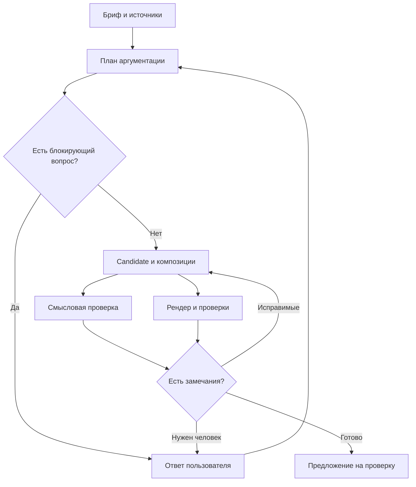
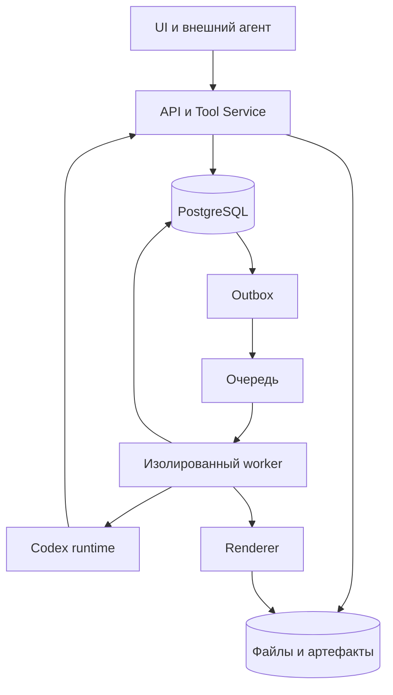

# Lanka Studio — чертёж продукта и реализации v3

Дата: 5 сентября 2026. Основание: `docs/prd/v2_0.md`, обязательный Brand Onboarding из `v1_2.md`, повторная сверка исходного кода и последнее уточнение заказчика. Этот документ дополняет PRD, исходные документы не переписываются.

## 1. Решение, которое меняет продукт

**Слайд — поверхность просмотра. Пользователь управляет задачей, аргументацией и принятием изменений.** Inline-редактирование текста, перетаскивание объектов и обычный PowerPoint-подобный canvas исключены из целевого сценария. Это уточнение имеет приоритет над старыми требованиями к inline editing, включая соответствующий шаг демонстрации PRD.

Три способа направить изменение:

1. Поручение агенту: «Вывод слишком общий. Обоснуй его данными за квартал».
2. Комментарий к конкретному тезису, числу или изображению: что не устраивает и какой результат нужен.
3. Точная корректировка в отдельной форме: пользователь задаёт замену, видит предложенный вариант, отправляет его на проверку. Прямой записи в слайд при вводе нет. Это путь для опечатки, числа, формулировки и работы при недоступном агенте.

Во всех случаях результат изменения контента должен быть reviewable proposal. Бриф и настройки задачи имеют собственные явные действия сохранения и историю. Выбор шаблона — отдельное изменение с предварительным просмотром затронутой презентации.

**Продуктовая цель:** корпоративный автор приносит намерение и материалы, получает логически связную презентацию в утверждённом визуальном языке и выпускает её после понятной проверки. Время автора уходит на решения, а не на оформление.

## 2. Что есть и чего недостаточно

Объём проверки: локальная реализация Lanka; установленный CreatPPT 0.1.4, его публичные типы и наши импорты; актуальные страницы исходных репозиториев. Это не полный аудит кода и безопасности всех upstream-проектов.

| Область | До этой итерации | Изменение в 0.3 | Остаток до целевого продукта |
|---|---|---|---|
| Создание | Готовая структура Markdown/JSON | После открытия — рабочая поверхность логики | Настоящий бриф + файлы → вопросы → план → первая дека через Codex |
| Логика | Заголовки, текст и заметки | Сохраняемый бриф; роль, вывод, переход, вопросы слайда; карта аргументации | Извлечение утверждений, противоречия, альтернативные структуры, смысловая критика |
| Работа агента | Один вызов Chat Completions для существующих слайдов | Бриф и общий outline в snapshot; contract `intent` в предложениях | Codex runtime, tools, многошаговая работа, вопросы, render/repair, checkpoints |
| UI | Слайд, панель полей, агент сбоку | Логика / Слайды / Изменения; формы контента вынесены в предложение | Задача из брифа как главный вход, inbox решений, полноценный экран выполнения |
| Review | Текст и JSON diff в узкой панели | Визуальные пары до/после, сравнение логики, явное принятие | Зависимости между изменениями, блоковые якоря, обновление устаревших proposals |
| Шаблоны | Две палитры и семь композиций | Каталог назначения и ограничений, девять композиций, общая сцена для просмотра и экспорта | Версионируемый BrandPack: recipes, fonts, assets, fixtures, evidence, certification |
| Источники | TXT/MD/CSV/JSON и изображения, hashes | Ссылки доступны в контексте и корректировке | PDF/Office/XLSX extraction, page/cell anchors, statement-to-evidence |
| Хранение | D1 агрегат, ревизии, R2 файлы, CAS, receipts | Бриф и intent сохраняются теми же механизмами | Tenant-модель, candidate branches, durable events/outbox, резервное копирование и восстановление |
| Jobs | Сохраняемые runs, cancel fence, дневной лимит попыток | Механизмы сохраняются | Очередь, leases, рестарт worker, лимиты затрат, input-required и resume |
| Выпуск | Approval точной ревизии, JSON release, PDF/PPTX в браузере | Новые композиции поддержаны экспортом | Авторитетный серверный render, сохранённый PDF, manifest, разные Reviewer/Publisher |
| Enterprise | Роли отдельной презентации | Без расширения в этой итерации | OIDC, tenant/workspace, agent principal/scopes, governance, observability |

Количество реализованных полей или тестов не превращается в процент готовности P0. Сквозной сценарий PRD ещё не завершён. Провайдер модели и встроенный Codex сейчас не подключены; новый UI этого не имитирует.

В 0.3 убраны прямые canvas-команды добавления, удаления, перемещения и дублирования слайда. Их целевой возврат — через просмотр структурного предложения, задача CORE-02 ниже. Пока структуру можно подготовить через Markdown/JSON при создании; интерактивного структурного proposal ещё нет. Корректировка существующего слайда, включая числа и импорт CSV диаграммы, остаётся доступной без модели.

## 3. Какие исходные требования были правильными

Сохраняем agent-led/review-first, единое доменное ядро для UI и MCP, версии и происхождение данных, ограниченный agent principal, неизменяемый выпуск, сертифицируемый BrandPack и навыки `deck-prep`, `deck-visuals`, `deck-render`. Это основа продукта, а не последующая enterprise-надстройка.

Уточняем недостаточно конкретные места:

- «Агент строит логику» становится набором проверяемых артефактов и критериев, а не длинным промптом.
- «Хороший шаблон» означает покрытие реальных задач, устойчивую типографику, выразительные композиции и fixtures; цвета и число layouts недостаточны.
- «Просмотр diff» включает картинку, смысл, источники и зависимости, а не только JSON.
- «Jobs» разделяются на пользовательскую задачу, попытку агента и техническое задание worker.
- «Хранение» включает источник истины, candidate, lineage, конфликты, восстановление и правила удаления.
- Старый human-completable путь сохраняется через отдельные формы и proposals; свободный canvas из него исключается.

Полная исходная матрица требований остаётся в `REQUIREMENTS_MATRIX.md`. Нормативные поправки к ней — в разделе 12 этого документа.

## 4. Полный пользовательский сценарий

Пример: отчёт о квартале для совета директоров; нужно согласовать следующий этап проекта.

1. Автор нажимает «Поручить презентацию». Вводит аудиторию, решение, главную мысль, формат чтения, объём/длительность; прикрепляет отчёт, таблицу и прошлую презентацию. Выбирает сертифицированный BrandPack.
2. Сервис показывает фактический результат разбора каждого файла: страницы/листы, доступные данные, нераспознанные части. Агент задаёт только вопросы, которые влияют на аргументацию. У каждого вопроса есть причина и объект, который он блокирует.
3. Агент готовит «Предлагаемую логику»: тезис, последовательность выводов, доказательства, риски и решение. Пользователь может принять план, изменить цель или попросить альтернативный вариант. Для повторного отчёта план можно брать из предыдущего принятого цикла.
4. Агент выбирает recipes, строит candidate deck, рендерит, проверяет, исправляет. Пользователь видит готовые артефакты и нерешённые вопросы. UI не показывает выдуманный процент готовности или скрытые рассуждения модели.
5. Агент передаёт результат: короткое объяснение структуры, все previews, источники, проверенные ограничения, открытые вопросы и предложение изменений.
6. Рецензент читает сначала выводы, затем необходимые доказательства. Оставляет четыре замечания: к тезису, числу, графику и визуальной плотности.
7. Агент выпускает delta-proposal. UI показывает связанные группы: изменение числа требует изменения подписи и вывода. Независимые группы принимаются отдельно; зависимая группа принимается целиком.
8. Опечатка исправляется отдельной формой → preview → proposal → принять. На самом слайде нет курсора ввода.
9. Reviewer согласует точную версию. Publisher выпускает PDF/ссылку с manifest. Изменение любого закреплённого входа аннулирует согласование новой версии, но не старый выпуск.
10. В следующем квартале пользователь создаёт задачу обновления. Меняются данные и зависимые выводы, сохраняются принятые структура и стиль. Пользователь видит, что изменилось относительно опубликованного отчёта.

**Проверка полезности:** один новый автор проходит сценарий по интерфейсу без JSON, командной строки и вмешательства разработчика. Внешний Codex повторяет его через те же tools и доменные объекты.

## 5. Как агент создаёт и проверяет аргументацию

### 5.1 Артефакты вместо невидимой генерации

| Этап | Вход | Обязательный выход | Критерий перехода |
|---|---|---|---|
| Intake | Brief, файлы, политика доступа | SourceSnapshot + extraction report | Неудачные извлечения явно отмечены |
| Evidence | Извлечённые фрагменты и таблицы | EvidenceMap: claim, source anchor, дата, единицы, статус | Нет ссылок на отсутствующие/чужие материалы |
| Story | Brief + EvidenceMap | NarrativePlan: roles, takeaways, dependencies, alternatives, questions | Решение соответствует брифу; пробелы видимы |
| Compose | Принятый план + BrandPack | CandidateDeck с recipe/slot assignments | Типы slots, budgets и references валидны |
| Critique | План, candidate, evidence | LogicReview + конкретные issues | Критика проверяет доводы, а не хвалит оформление |
| Render/repair | Candidate + renderer | Previews, layout report, новый candidate при исправлении | Нет blocking issues; ограниченное число попыток |
| Handoff | Проверенный candidate | Proposal, summary, question list, provenance | Базовая ревизия и зависимости закреплены |

Смысловая критика проверяет: отвечает ли вывод на вопрос аудитории; достаточны ли доказательства; совпадают ли период, единицы и база сравнения; не выдана ли корреляция за причину; отражены ли ограничения; рассмотрена ли существенная альтернатива; следует ли решение из доводов.

Результат критики — объект с категорией, ссылкой на claim/slide, объяснением проблемы, evidence и предложением исправления. Не публикуем скрытую цепочку рассуждений и не используем её как журнал. Пользователю нужны проверяемые выводы и основания.

### 5.2 Координация цикла



Лимиты итераций и стоимости задаёт Task policy. При исчерпании бюджета задача заканчивается понятным partial result с доступными артефактами, а не бесконечным repair loop.

### 5.3 Реальный минимальный контракт 0.3

```ts
DeckDoc.brief?: {
  audience: string; decision: string; keyMessage: string;
};
Slide.intent?: {
  role: 'context' | 'problem' | 'evidence' | 'options' |
        'recommendation' | 'decision' | 'next_step';
  takeaway: string;
  transition: string;
  openQuestions: string[];
};
```

Поля необязательны для совместимости со старыми документами. Логика каждого изменённого слайда проходит через `propose_changes` вместе с его содержанием. `get_deck`/файловый пакет дают полный документ; `lint_deck` возвращает отдельную проверку полноты narrative. Внутренний одношаговый адаптер получает бриф и outline всей презентации, но меняет только выбранные слайды. Это полезный контракт для следующего runtime, не реализация всего pipeline.

Следующий контракт расширяет эту модель стабильными `claimId`, `blockId`, `evidenceId`, `sourceSpan`, `dependsOn`, `rationaleSummary` и candidate revision. Нельзя хранить аргументацию только в notes: её нельзя будет надёжно проверить или связать с изменением.

## 6. Новый UI: поверхности, действия и состояния

### 6.1 Навигация продукта

Основные разделы: «Задачи», «Презентации», «Шаблоны», «Материалы». Выпуски доступны из презентации и общего поиска. Настройки, runtime, лимиты, интеграции и технические jobs — административная область.

Внутри презентации: **Логика / Слайды / Изменения / Выпуск**. Первые три поверхности реализованы в 0.3; выпуск пока использует прежние элементы управления. Глобальная панель агента в целевой версии становится контекстным поручением, а не постоянным обязательным столбцом.

| Поверхность | Что занимает основную площадь | Главное действие | Что показывать при проблеме |
|---|---|---|---|
| Задачи | Моя работа, ожидание ответа/проверки, последний результат | Поручить презентацию | Последний сохранённый артефакт и следующий доступный шаг |
| Бриф | Аудитория, решение, материалы, шаблон | Начать подготовку | Недостающие данные и ошибка разбора конкретного файла |
| Выполнение | Этап, вопросы, найденные данные, промежуточные артефакты | Ответить / уточнить задачу | Failed/expired/cancelled различаются; есть контекст повторного запуска |
| Логика | Последовательность выводов, основания и переходы | Уточнить план | Необоснованные утверждения и незаполненные роли |
| Слайды | Чистый preview, rail, источники по запросу | Поручить доработку / предложить корректировку | Ошибка композиции привязана к слайду |
| Изменения | Полноразмерное до/после и смысл изменения | Принять выбранные группы | Конфликт блокирует принятие и предлагает обновить proposal |
| Выпуск | Закреплённые версии и blocking checks | Передать на согласование / выпустить | Кто должен принять решение и что его блокирует |
| Шаблоны | Примеры реальных recipes и тестовая дека | Выбрать стиль / проверить pack | Статус черновика, unsupported cases и результаты fixtures |

### 6.2 Правила дизайна

- Светлая спокойная рабочая поверхность, выразительная типографика, один акцентный цвет для основного действия. Статус передаётся текстом и иконкой, а не только цветом.
- Preview должен быть крупнейшим объектом на экране слайда; JSON и технические логи находятся в раскрываемых подробностях.
- В карте логики номер и роль слабее по весу, чем вывод. Источники и переход идут рядом с утверждением, а не в далёкой боковой панели.
- На review сначала объяснение «что и зачем», затем визуальная пара, затем источники/данные. Проверка числового изменения не должна требовать чтения JSON.
- Комментарий превращается в адресуемый запрос: открыто → принято в работу → предложено исправление → проверено. Закрытие комментария само по себе не означает, что content исправлен.
- На ноутбуке второстепенная панель сворачивается; сравнение становится последовательным, если две картинки нечитаемы. На мобильном приоритет — чтение и решения.
- Никаких фиктивных стадий «агент думает», если backend этого не знает. Событие UI должно иметь сохранённый event ID.
- Полные состояния: empty, loading, running, awaiting input, awaiting review, conflict, partial result, failed, cancelled, expired, approved, released.

### 6.3 Точная корректировка без inline

В 0.3: отдельный диалог с вкладками «Содержание», «Логика», «Композиция» и preview. Ввод меняет только локальный candidate. Кнопка отправки требует причину; сервер сохраняет предложение. После закрытия автор видит его в «Изменениях»; исходный документ прежний. Принятие фиксирует новую ревизию. При конфликте диалог не теряет введённый текст.

Дальше: режим короткой замены текста и числа без всей формы, сравнение исходного/предложенного значения, привязка к block ID, обязательное основание для изменения факта. Для перестановки и добавления слайда — отдельный обзор структуры, который тоже заканчивается proposal.

## 7. Шаблоны: от палитры к качеству

**BrandPackRelease** должен включать tokens, fonts с лицензией/хешем, logos/assets, semantic components, layout recipes, slot contracts, правила языка и тона, image profile, examples, anti-patterns, fixtures, renderer compatibility и provenance. Пользователь выбирает пригодный стиль, а агент — подходящую композицию внутри него.

### 7.1 Первые семейства

Предлагаются три различимых назначения, а не три перекрашенные копии:

| Семейство | Задача | Принцип |
|---|---|---|
| Executive / Decision | Совет директоров, стратегия, инвестиционное решение | Заголовки-выводы, компактные доказательства, ограничения и явный запрос решения |
| Research / Evidence | Аналитика, исследования, внутренние обзоры | Читаемые графики, единицы/периоды, источники, методика и оговорки |
| Product / Story | Продукт, клиентский сценарий, демонстрация | Последовательность, реальные изображения, контекст пользователя и эффект |

Это направления проектирования. В 0.3 эти три полноценных pack ещё не созданы.

### 7.2 Набор recipes и покрытие

Для базовой библиотеки проектировать 12–18 recipes; для конкретной организации отбирать по её реальным референсам и задачам. Начальное ядро: cover, executive summary, statement + evidence, KPI, trend, comparison, options/trade-offs, process, timeline, image proof, risks, decision, next steps, appendix/table. Число само по себе не критерий готовности.

У recipe есть: смысловая задача, допустимые slots, ограничения текста/данных, типографическая иерархия, safe areas, crop rules, варианты плотности и fallback. Переполнение вызывает выбор другого recipe или предложение разделить слайд; не бесконечное уменьшение шрифта.

В 0.3 каталог описывает назначение девяти простых композиций. `statement` и `steps` добавлены в общий renderer. `steps` допускает 2–4 абзаца; превышение блокирует формальный проход. Эти композиции — стартовый набор, не сертифицированный корпоративный pack.

### 7.3 Процесс Brand Onboarding

1. Собрать брендбук, PPTX/POTX, логотипы, шрифты и примерно 20 репрезентативных слайдов.
2. Извлечь кандидаты правил и привязать каждый к evidence: документ, страница/объект, authority.
3. Отделить нормативные правила от иллюстраций, исключений и устаревших примеров; показать конфликты.
4. Дизайнер и интегратор составляют recipes по наблюдаемым задачам; фиксируют coverage и неподдержанные случаи.
5. Сгенерировать тестовую деку на реальном русском и английском контенте, цифрах и источниках.
6. Прогнать fixtures, визуально оценить дизайнером, исправить; Brand Admin сертифицирует конкретный immutable release.
7. Новая версия pack не меняет существующие выпуски. Миграция документа показывает diff всей деки.

### 7.4 Приёмка качества

Автоматически: схема/slots, переполнение, недоступные шрифты и ассеты, некорректные числовые данные, контраст, выход за safe area, пропавшие элементы при экспорте. Fixtures содержат длинную кириллицу, двухзначные и шестизначные числа, отрицательные/нулевые значения, длинные единицы, отсутствие необязательного текста, предельное число рядов и нестандартные пропорции изображений.

Дизайнер проверяет иерархию, ритм всей презентации, выбор композиции, визуальный вес, читаемость и соответствие бренду. Автор проверяет убедительность и пригодность для аудитории. Автоматический score не заменяет эти решения.

Предлагаемый стартовый gate: 100% обязательных fixtures проходят; нет blocking layout issues; все фактические утверждения имеют источник или явно помеченный статус допущения; согласованное покрытие референсов достигнуто. Точный target coverage и размер шрифта задаются pack policy, не универсальным магическим числом.

### 7.5 Визуалы и библиотека материалов

Агент выбирает сначала утверждённый корпоративный ассет, затем разрешённый внешний поиск, затем генерацию при подходящей задаче. Image broker применяет политику workspace и возвращает asset ID, происхождение, условия использования и преобразования/crop. Числовые графики, схемы и другие точные объекты строятся из данных; растровая генерация не заменяет их. `deck-visuals` объясняет назначение изображения, а renderer проверяет его пригодность к выбранному slot. Этот broker пока не реализован; существующий путь — загрузка PNG/JPEG.

## 8. Хранение, совместная работа и jobs

### 8.1 Где источник истины

| Объект | Хранилище | Инвариант |
|---|---|---|
| Tenant, workspace, membership, scopes | PostgreSQL | Доступ проверяется в API и tools для каждого объекта |
| Brief, task, plan, document, proposal, approval | PostgreSQL, immutable revisions | Main меняется только валидной командой; proposal основан на конкретной revision |
| SourceSnapshot, изображения, fonts, previews, PDF | S3-compatible object storage | Контент по hash, метаданные и grants в БД; пути не предоставляют доступ сами по себе |
| Run events, questions, tool receipts, outbox | PostgreSQL | Упорядоченный поток событий и идемпотентные записи |
| Queue jobs | Устойчивая очередь | Доставка может повторяться; job ID не равен task ID |
| Sandbox working directory | Изолированный worker | Временная разрешённая проекция; не единственная копия результата |
| Codex session/checkpoint | Изолированный durable storage | Возобновление подтверждается checkpoint и receipts, одного thread ID мало |



На схеме только worker control plane пишет служебные события в БД; Codex работает через ограниченный Tool Service. Browser не соединяется с Codex App Server напрямую.

### 8.2 Конкурентность

В P0 нужны optimistic concurrency, candidate branches, idempotency, dependency-aware review и уведомления. CRDT не решает согласование выводов и зависимых правок и не является условием отсутствия потерянных данных. Realtime presence можно добавить независимо; совместное редактирование брифа оценить позднее.

Ключ команды: tenant + principal + requestId; payload fingerprint обязателен. Повтор возвращает receipt, изменённый payload с прежним ID отклоняется. Candidate закрепляет base revision и разрешённые inputs. При принятии сервер проверяет before image каждой затронутой сущности и все зависимости до любой мутации. Устаревший proposal не перезаписывается молча.

### 8.3 Lifecycle выполнения

`Task` — намерение пользователя; `Run` — попытка/итерация; `Job` — техническая работа. Один task может иметь вопросы, несколько runs и несколько render jobs.

Целевые состояния run: queued → running → awaiting_input / awaiting_review / succeeded / failed / cancelled / expired. Resume пользовательского вопроса продолжает ту же задачу, но явно фиксирует новый input snapshot. Lease owner, fencing token и heartbeat обязательны; просроченный worker лишается права записи. Отмена сначала закрывает запись результата, затем прерывает процесс.

Outbox создаётся в одной транзакции с task/run. События имеют монотонный sequence; UI восстанавливает поток после reconnect. Worker сохраняет tool receipt до повторного планирования после сбоя. Побочные действия изображения/экспорта имеют собственный idempotency key. Не обещаем exactly-once исполнения внешних вызовов: гарантируем отсутствие двойного применения доменных изменений и контролируем повторяемые действия.

### 8.4 Размещение

Текущий Sites/D1/R2 остаётся доступным пилотом. Полный Codex-процесс требует отдельной среды выполнения. Целевой переносимый контур: Node API, PostgreSQL, S3-compatible storage, очередь, отдельные Codex/render workers. Для пилота достаточно модульного монолита и worker pool, Kubernetes не является обязательным первым шагом.

Предпочтительно проверить уже используемое окружение `shop reuse app` из `hills`: есть ли длительные процессы, контейнерная изоляция, управляемая БД, object storage, secrets, разрешённый inference и восстановление. В доступных материалах его конфигурация не найдена, поэтому нельзя утверждать, что оно подходит или перенос уже выполнен. Выбор Яндекс Облака или другого провайдера делается после этой проверки и требований организации к размещению; создавать второй контур до неё не нужно.

### 8.5 Шеринг и переиспользование

Доступ к рабочей презентации, комментирование и доступ к конкретному выпуску — разные разрешения. Ссылка на release ведёт к закреплённой версии; последующая правка не меняет её содержимое. Отзыв доступа проверяется и на скачивании ассета, и на чтении metadata.

Библиотека повторного использования хранит утверждённые слайды/блоки и их lineage. Вставка создаёт локальную копию с новыми ID и ссылкой на origin revision; доступ к исходным файлам не наследуется автоматически. До подтверждения импорта UI показывает, какие источники и брендовые зависимости доступны получателю. Обновление оригинала предлагает upgrade proposal, а не тихо меняет чужую презентацию. Полный сценарий ещё не реализован; текущий JSON clone уже умеет переносить доступные source references внутри экземпляра.

## 9. Что брать из репозиториев

| Репозиторий | Фактически используется | Следующий предметный шаг | Что остаётся нашим |
|---|---|---|---|
| [CreatPPT](https://github.com/seekskyworld/CreatPPT), установлен 0.1.4 | `parseBrief`, `CANVAS`, `box`, `inset`, `canvasToInches` | Spike адаптера `contentPlanFromInput` / `compileContentPlan`, `buildLayoutCandidates`, `inspectPipeline`; сравнить outputs на корпусе | Canonical AST, revisions, permissions, review, evidence lineage |
| [PptxGenJS](https://github.com/gitbrent/PptxGenJS), 4.0.1 | Нативные PPTX text/shapes/images/notes | Сохранить адаптер; расширять по мере появления semantic components | Авторитетная модель, approval, renderer policy |
| [pdf-lib](https://github.com/Hopding/pdf-lib), 1.17.1 | PDF и встраивание кириллических шрифтов | Перенести генерацию в server worker и фиксировать output hash | Manifest и воспроизводимость выпуска |
| [Presenton](https://github.com/presenton/presenton) | Код не импортирован | Изучить конкретные template/intake adapters и конвертировать один шаблон в наши slot contracts; закрепить commit перед переносом | Enterprise координация и канонические команды |
| [PPTist](https://github.com/pipipi-pikachu/PPTist) | Код не импортирован | Не включать его canvas в этот сценарий; отдельный экспортный/импортный spike только при доказанной необходимости | Agent-led workflow без inline |
| [BlockSuite](https://github.com/toeverything/blocksuite) | Код не импортирован | Отложить до реальной потребности в совместном rich-text брифе | Согласование proposals не передаётся CRDT |

CreatPPT действительно имеет планирование, layouts и quality pipeline в публичных exports. Сейчас мы используем малую часть этого слоя. Его свободные элементы и редактор не нужно переносить вместе с нужным planner. Адаптер обязан проверять потерю полей и несовместимость схем. Источник: установленный `node_modules/@seekskyworld/creatppt/dist/node/domain/index.d.ts` и [архитектура upstream](https://github.com/seekskyworld/CreatPPT#architecture).

Presenton описывает custom templates и generation pipeline; это основание для изучения, не доказательство совместимости конкретного модуля. Перед копированием нужен pinned commit, license/NOTICE, список файлов и контрактные fixtures. [Исходный проект](https://github.com/presenton/presenton).

PPTist заявляет AGPL-3.0 и отдельные варианты лицензирования. Его код сейчас не включаем; лицензионный режим оценивается для выбранных файлов и способа использования. [Лицензирование upstream](https://github.com/pipipi-pikachu/PPTist#agpl-30-协议).

Конкретных дополнительных GitLab-URL в предоставленных исходниках нет. Univer в установленной реализации также не используется. Нельзя записывать их интеграцию в выполненную работу.

**Правило переиспользования:** каждый перенос закрывает пользовательский сценарий, имеет точную версию, adapter boundary, fixture и запись в THIRD_PARTY_NOTICES. Не объединяем несколько готовых редакторов в ещё один редактор.

## 10. User stories и условия приёмки

| ID | История | Проверяемый результат | Статус |
|---|---|---|---|
| US-01 | Как автор, хочу получить презентацию из цели и материалов | Бриф + 3 файла → вопросы → 10 слайдов без написания Markdown | Следующий сквозной этап |
| US-02 | Хочу понять, почему презентация устроена так | Видны roles/takeaways/transitions, sources и вопросы; можно запросить альтернативу | Карта и поля есть; автоматическая подготовка/альтернатива нет |
| US-03 | Хочу исправить одно число или формулировку | Отдельная форма → candidate preview → proposal → accept, исходник до accept прежний | Реализовано для существующего слайда |
| US-04 | Хочу поменять порядок и добавить доказательство | Структурный proposal с insert/move и зависимостями, preview всей деки | CORE-02 |
| US-05 | Как рецензент, хочу проверить только существенные изменения | Визуальная пара, rationale, числовой diff, связанные comments | Визуальная пара и intent есть; semantic grouping нет |
| US-06 | Хочу принять часть результата | Независимые группы отдельно; связанные не распадаются | Отдельные слайды есть; dependency graph нет |
| US-07 | Хочу продолжить после сбоя | Последний checkpoint и вопрос сохранены; нет двойных изменений/списаний | Идемпотентность домена есть; durable resume нет |
| US-08 | Как дизайнер, хочу качественный корпоративный стиль | Brand evidence → recipes → fixtures → test deck → human certification | Базовые композиции; onboarding нет |
| US-09 | Хочу проверить утверждение по исходнику | Открывается точная страница/ячейка закреплённого snapshot | Файловые ссылки есть; anchors нет |
| US-10 | Как издатель, хочу выпустить проверенную версию | Разные роли, server PDF, manifest и доступ к immutable release | Часть механизмов; enterprise release нет |
| US-11 | Хочу обновить прошлый отчёт | Новый data snapshot → изменения чисел и зависимых выводов → review | Не реализовано |
| US-13 | Хочу переиспользовать утверждённый материал другой команды | Поиск с учётом доступа, origin revision, проверка зависимостей, управляемое обновление | JSON clone есть; каталог и upgrade proposals нет |
| US-12 | Хочу использовать свой внешний агент | Тот же Task/Proposal/Source API и те же ограничения, полный workflow | Подмножество MCP есть; P0 tool surface неполна |

## 11. План разработки по зависимостям

Это backlog с выходными артефактами, а не обещание календарных сроков. Оценку времени уточнять после runtime и source-extraction spikes.

| Этап / задачи | Что сделать | Gate, без которого этап не закрыт |
|---|---|---|
| A — UX-01, NAR-01, VIS-01 | Read-only review, бриф/intent, визуальное сравнение, отдельная корректировка, каталог базовых композиций | Проход точной правки без изменения main до accept; старые документы читаются; PDF/PPTX поддерживают новые композиции |
| B — RUN-01, CORE-01, SRC-01 | Реальный Codex в изоляции; Tool Service; task/run/events; извлечение 3 типов файлов; сохранённые вопросы | Бриф + файлы → проверяемый plan; interruption/reconnect не теряют результат |
| C — CORE-02, NAR-02, REVIEW-02 | Candidate revisions; insert/move/remove; stable blocks/claims; critique; dependency-aware proposals | Greenfield 10 слайдов и цикл четырёх комментариев; stale proposal не перезаписывает изменения |
| D — BRAND-01, RENDER-01, VIS-02, REUSE-01 | Реальный клиентский BrandPack; fixture corpus; image broker; server render/repair; один доказанный upstream adapter | Дизайнер принимает test deck; 3 искусственные ошибки исправляются; все previews доступны |
| E — ENT-01, REL-01, OPS-01 | Tenant/OIDC/agent scopes; Reviewer/Publisher; immutable PDF+manifest; backup/restore | PRD Demo A и Brand Demo B проходят; восстановление и изоляция проверены |
| F — PILOT-01 | 10 реальных циклов одной команды; сравнение с исходным процессом | Измерены ручное время, доля доработок, ошибки фактов/бренда, стоимость и acceptance |

A реализован в 0.3 в указанном ограниченном объёме. B–F не объявляются выполненными. Brand discovery и инфраструктурный spike можно начать одновременно с B, но основной пользовательский сценарий не закрыт без D и E.

### Практический порядок следующей работы

1. Получить конфигурацию существующего внешнего окружения и проверить условия для worker; подготовить deployable runtime adapter локально.
2. Реализовать Task и event stream, сохранение вопросов, snapshots и tool receipts; подключить реальный Codex к ограниченному набору tools.
3. Провести один вертикальный проход «brief → evidence → story plan» и оценить качество на реальном отчёте.
4. Расширить proposal до структурных операций и candidate; добавить реализацию полного слайдового цикла.
5. На референсах организации создать первый полноценный BrandPack, проверить визуальную систему и server export.
6. Только после этого расширять каталог, регулярные обновления и новые runtime adapters.

## 12. Поправки к требованиям и критерии демонстрации

| Старое ожидание | Нормативная поправка |
|---|---|
| Inline editing / PR-EDIT-001 / соответствующий шаг Demo A | Отдельная точная корректировка → preview → proposal → human accept |
| Canvas как human-completable fallback | Структурированные формы и операции над candidate; canvas отсутствует |
| AI sidebar как достаточная интеграция | Бриф, план, вопросы, tool execution, проверки и handoff — основной путь |
| Выбор шаблона как выбор палитры | Выбор BrandPackRelease; recipe selection и budgets внутри pack |
| Логика не представлена явным объектом | NarrativePlan/claims/evidence и проверяемая critique обязательны |

Приёмочная демонстрация: исходный Demo A из PRD сохраняется, кроме способа точной правки. Автор приносит бриф и три файла; агент готовит десять слайдов, выявляет три внедрённые ошибки и исправляет их; рецензент оставляет четыре замечания; принимает и отклоняет независимые группы; исправляет опечатку через отдельную форму; разные Reviewer/Publisher выпускают PDF с manifest. Demo B Brand Onboarding остаётся обязательным.

## 13. Как посмотреть текущую итерацию

1. Открыть существующую презентацию: первая рабочая поверхность — «Логика». Если данных нет, UI показывает незаполненные роли; не приписывает их агенту.
2. Сохранить аудиторию, решение и главную мысль через «Уточнить бриф».
3. Открыть карточку слайда → «Предложить корректировку». Задать вывод/роль/переход на вкладке «Логика» и объяснить причину.
4. Убедиться, что текущий слайд не изменился; на вкладке «Изменения» посмотреть оба варианта, выбрать слайд и принять.
5. Проверить новую ревизию и карту аргументации. Для агентного предложения использовать пакет/MCP; одношаговый провайдер требует настройки.
6. В «Шаблонах» просмотреть каталог. В корректировке выбрать «Ключевой вывод» или «План действий»; учесть подсказки по плотности.

Исходники: `components/story-board.tsx`, `correction-dialog.tsx`, `proposal-board.tsx`, `template-gallery.tsx`, `lib/domain/narrative.ts`, `recipes.ts`, `scene.ts`. Проверки и известные ограничения — `VALIDATION.md`.

## 14. Что имеет смысл обсудить на следующем проходе

Предлагаемые исходные решения уже приняты для разработки: read-only slides; точная форма как запасной путь; проверка story plan перед дорогой композицией; один реальный корпоративный pack до масштабирования; переносимый API + отдельные workers.

Для следующего прохода полезны три конкретных материала: один реальный повторяющийся отчёт и его аудитория; брендбук с удачными/неудачными референсами; конфигурация среды `hills`. Они позволят проверить качество на рабочей задаче и выбрать размещение без предположений. Обсуждение не блокирует уже сделанные изменения 0.3.

## Обновление выполнения — 0.4

Реализованы интерфейс и сохраняемая машина состояний задач, двухэтапное принятие плана/кандидата, bounded Office/PDF extraction и отдельный установленный Codex App Server worker. Это выполнение части B/C; их live gate не закрыт без настроенного gateway и модели. Точная сверка реализованного и оставшегося: [IMPLEMENTATION_PROGRESS_V04.md](IMPLEMENTATION_PROGRESS_V04.md). Исходные gates выше сохраняются.
