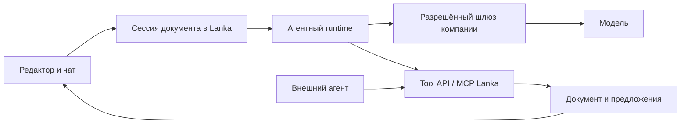

# Lanka: быстрые красивые презентации для компаний

6 сентября 2026. Продуктовая рекомендация по последнему заданию владельца. Главные приоритеты заданы владельцем: скорость, сильный визуальный результат, удобная ручная правка, обсуждение и редактирование с агентом, в том числе через прокси; PPTX/PDF по потребности. Выбор первого сегмента, численные цели и коммерческая модель ниже — гипотезы для проверки, не подтверждённый спрос.

Этот документ задаёт продуктовый фокус. Он корректирует прежнюю последовательность «review-first → согласование → канонический PDF» из PRD v2.0 и технического плана. Права, сохранность данных и видимость агентных изменений сохраняются. Актуальная детализация и порядок — в [пакете разработки](planning/README.md): истории, сверка требований, архитектура/данные/MCP, настоящий чат и очередь работ. Первый живой тест подключения агента начинается до завершения всего редактора; прежние подробности блоков и экспорта из [VISUAL_EDITOR_IMPLEMENTATION_PLAN.md](VISUAL_EDITOR_IMPLEMENTATION_PLAN.md) применяются с этими уточнениями.

Последующее обязательное уточнение владельца: Lanka — открытый продукт для самостоятельного развёртывания в контуре компании. Презентации остаются первым типом материалов; возможность интерактивных отчётов/прототипов и работа с более сильными сменяемыми агентами рассматриваются в [OPEN_WORKSPACE_STRATEGY.md](OPEN_WORKSPACE_STRATEGY.md). Этот документ определяет обновлённые требования к размещению: облако Lanka/Sites не является обязательной зависимостью, а самостоятельная установка входит в первый корпоративный продукт.

## 1. За что должна платить компания

**Сотрудник быстро получает презентацию, которую можно показать клиенту или руководителю, и доводит её без дизайнера — сам или вместе с агентом. При этом сохраняются стиль компании, проверенные материалы и понятная история правок.**

HTML, MCP, модель и внутренние процессы обеспечивают этот результат. В обычной работе человек видит презентации, папки, слайды, комментарии и кнопку скачивания.

Предлагаемый первый сегмент — продажи/пресейл в B2B-компаниях, где регулярно адаптируют презентации под конкретного клиента. Пользователь — менеджер/пресейл; внутренний заказчик — руководитель продаж или маркетинга; владелец стиля и утверждённых материалов — маркетинг. Предположение о частоте и готовности платить нужно проверить на реальных командах.

Первый сценарий: «Из нашей базовой презентации, кейсов и заметок о клиенте подготовь 8 слайдов для встречи с операционным директором. Затем помоги сократить, уточнить и оформить». Он включает создание, повторное использование, обсуждение и адресные изменения. Презентации совета директоров с финансовой отчётностью требуют более строгих data/approval-контрактов и могут стать следующим сегментом.

Ожидаемое преимущество: хороший результат **в стиле конкретной компании**, быстрая повторная адаптация, качественные точечные правки и небольшой объём ручной доводки. Это нужно доказывать на равных брифах. Общие библиотеки шаблонов и фирменных материалов уже есть у [Gamma](https://help.gamma.app/en/articles/12590858-how-do-i-use-workspace-templates) и [Pitch](https://help.pitch.com/en/articles/6010928-organize-your-workspace-library); Pitch также документирует [Agent/MCP/API](https://help.pitch.com/en/). Само наличие этих функций не является достаточным отличием Lanka. Здесь проверены описания продуктов, не качество их генерации.

## 2. Основной путь пользователя

1. **Начать.** «Новая презентация», «На основе этой» или «Обновить прошлую». Вход: короткое поручение и материалы. Стиль компании уже выбран. Аудитория/повод/объём видны как редактируемые предположения; вопрос задаётся, когда ответ существенно меняет результат.
2. **Получить первый результат.** Создаётся личный черновик. По мере готовности появляются пригодные для просмотра слайды. План доступен, но его отдельное подтверждение не обязательно для обычного первого черновика. Для чувствительного сценария компания может включить согласование содержания до оформления.
3. **Доработать.** Пользователь меняет текст на слайде, заменяет/кадрирует изображение, редактирует данные диаграммы, переставляет страницы, выбирает совместимую композицию. Сохранение и отмена работают без агента.
4. **Обсудить.** В чате можно спросить «почему такой вывод?», «какие есть варианты?» или поручить «сократи второй слайд»/«замени этот кейс». Выделение слайда/блока задаёт понятный контекст. Вопрос не запускает незаметную правку.
5. **Увидеть изменения.** Предложенный вариант сразу показывается на слайде с подсветкой изменённых блоков. Рядом доступны «Оставить правки», «Отменить», раскрываемое сравнение. Одно поручение может приниматься целиком; отдельные блоки — по желанию. Исходная сохранённая версия не исчезает.
6. **Передать.** Ссылка на просмотр/обсуждение, режим показа, PDF или PowerPoint. Автор выбирает живую ссылку либо зафиксированную версию. Получателю понятно, какой документ и какая версия перед ним.

Для первого нового документа поручение «создай» уже разрешает сборку черновика. Не нужны подтверждения каждого внутреннего шага. При изменении существующего общего документа предложение не подменяет основную версию до принятия. Формальное утверждение/публикация появляется там, где его требует процесс компании.

Основной экран: компактная шапка с названием, сохранением, историей и передачей; слева миниатюры; в центре крупный слайд; справа свойства выбранного элемента. Чат открывается по необходимости вместо одной из боковых панелей. На телефоне в первую очередь нужны просмотр, замечание, понятное сравнение и небольшая правка текста. Бриф/настройки агента не занимают экран постоянно.

### Главная, примеры и взаимодействие

Дополнение по пожеланию владельца: главная должна давать опыт исследования работ, как у Higgsfield. На [его главной](https://higgsfield.ai/) и в [Community](https://higgsfield.ai/community) есть подборки и публичные проекты для просмотра. Это подтверждает референс по структуре; конкретную механику лайков Higgsfield в этом проходе не проверяли. Следующие действия — предложение для Lanka.

**Главная → понравившаяся презентация → просмотр/обсуждение → создать на основе → собственный редактор.** Здесь можно прийти без готового брифа и выбрать визуальное направление. «Мои документы» остаются доступным одним нажатием рабочим каталогом с папками. «Сохранённое» собирает избранные примеры; это не копирование документа.

Главная показывает крупные обложки с возможностью открыть несколько слайдов, название, автора, число страниц и область доступа. В первой версии — подборка Lanka и доступные работы команды. Публичное сообщество с публикациями пользователей может появиться следующим шагом. Начальный контент готовит команда Lanka; демонстрационные лайки из макета не переносятся в реальные счётчики.

| Действие | Пользовательский смысл | Контракт первой реализации |
|---|---|---|
| Нравится | Отметить удачную работу, поддержать автора | Один обратимый лайк от пользователя на пример; серверная уникальность, реальный счётчик |
| Сохранить | Вернуться к примеру позже | Личное избранное; добавление не раскрывает документ другим людям и не даёт дополнительных прав |
| Посмотреть | Оценить всю работу перед выбором | Быстрый просмотр слайдов и понятное возвращение в ленту; мобильные свайпы/кнопки |
| Обсудить | Оставить отзыв о работе или выбранном слайде | Комментарии аудитории публикации отдельно от внутренних замечаний редактора; авторство и привязка к версии |
| Создать на основе | Быстро начать свою презентацию | Личная копия разрешённых содержания и оформления с новыми ID, ссылкой на исходный пример и закреплённой версией; оригинал не меняется |

После копирования пользователь может поручить агенту «адаптируй под нашего клиента» и увидеть изменения. Перенос только оформления без исходных фактов можно добавить отдельным вариантом. Автор/компания определяет разрешение на копирование; доступ к просмотру сам по себе не разрешает повторное использование всех материалов.

**В компании лента учитывает права доступа.** Личный черновик не становится работой команды автоматически. Публикация наружу — отдельное явное действие уполномоченного человека над конкретной версией. В предпросмотр публикации входят только выбранные слайды; внутренние обсуждения, исходные файлы и агентная переписка в неё не включаются автоматически. Приватные работы не участвуют в публичных рекомендациях и счётчиках. Отзыв доступа убирает превью из ленты и сохранённого; уже разрешённые копии и скачанные файлы не считаются удалёнными из чужих рабочих пространств.

Для разработки нужны отдельные сущности опубликованного примера, реакции и сохранения: они ссылаются на документ/версию, не меняют содержание DeckDoc. Сервер фильтрует выдачу и проверяет доступ при открытии, реакции, комментарии и копировании. Новая версия примера не подменяет незаметно версию, которую уже обсуждали. Отдельные журналы каждого лайка не засоряют историю редактирования слайдов.

**Первый объём:** главная с отобранными примерами, просмотр, личное сохранение, лайк и создание копии; затем публикация работ команды и обсуждения. Публичная пользовательская лента требует собственного потока публикации, жалоб и модерации. Подписки на авторов, подборки сообщества и рекомендации развиваются после появления достаточного контента и повторного использования. Для старта подходят редакционная подборка и простые фильтры; сложное ранжирование не нужно.

Успех этой главной измеряется переходом из просмотра примера в пригодную собственную презентацию и сокращением времени до первого результата. Лайки и сохранения помогают находить полезные работы, но не заменяют эти показатели. Интерактивный макет проверяет переходы и действия на демонстрационных данных; серверные реакции, многопользовательские комментарии и публикация в текущем приложении ещё не реализованы.

## 3. Как обеспечить визуальное качество

Красота требует собственного процесса разработки и приёмки. Нулевые переполнения — только технический минимум.

**Дизайн-пакет компании** включает типографику, сетку, цвета, формы, изображения, допустимую плотность и правила сочетания композиций. Для старта предлагается одна сильная система с 8–12 семействами композиций и 2–3 осмысленными вариантами там, где они полезны: обложка, аргумент, сравнение, кейс, схема процесса, показатели, диаграмма, таблица и итог. Проверяется новая информация разной длины, а не только удачный образец.

**Агент сначала решает, что показать.** Для каждого слайда: аудитория, задача, главный тезис, доказательство, визуальная форма и доступный материал. Затем выбирается композиция. Если содержание не помещается, система пробует подходящий вариант или предлагает разделить слайд. Изменение смысла/чисел не маскируется под техническое исправление вёрстки.

**Изображения подбираются под место и смысл.** Приоритет — материалы компании, настоящие продукты/скриншоты/кейсы и подходящие лицензированные изображения. Генерация помогает там, где нужна иллюстрация, и планируется вместе с кадром. Для серии сохраняется единый визуальный язык. Выбранный asset фиксируется; повторное открытие слайда не генерирует новую картинку.

**Нужна проверка всей деки:** ритм, иерархия, контраст, разнообразие композиций, согласованность стиля, читаемость диаграмм. Критик модели предлагает замечания, а человек оценивает реальные слайды. Один красивый титул не делает красивой презентацию.

**При настройке бренда** команда продукта вместе с дизайнером может вручную довести первый пакет по 2–3 хорошим презентациям клиента. Клиенту показывают небольшой образец и фиксируют правила. Сначала полезно доказать качество такого процесса, затем автоматизировать извлечение стиля. Услуга настройки не должна скрывать ручное изготовление каждой последующей деки.

**Для скорости** переиспользуются проверенные блоки, факты и assets; рендерятся изменённые страницы; тяжёлые операции выполняются в очереди. Возможные композиции сравниваются на небольшой части деки, а не тремя полными генерациями по умолчанию. Правка фразы не должна повторно запускать генерацию изображений и всей истории.

## 4. HTML, документ и экспорт

Рекомендуемая основа: **структурированный документ + библиотека компонентов + общий RenderPlan + браузерное отображение/редактор**. HTML/CSS и SVG могут сочетаться. Первый inline-редактор работает HTML-полем поверх текущего Focus 3; дальнейший переход компонентов в HTML определяется преимуществом для качества и редактирования.

Документ сохраняет целые текстовые блоки, устойчивые ID, числа и источники, изображения/crop, выбранные варианты композиции. Он не хранит результат произвольной генерации HTML как единственную копию смысла. Макет и история принадлежат Lanka, а не конкретной модели.

У компонента есть исходные данные, способ компоновки, возможности ручной правки и экспортный адаптер. Система один раз разрешает шрифт, геометрию, clip и порядок слоёв. Текст выгружается целым textbox, диаграмма — native chart с worksheet, таблица — таблицей. Сложная иллюстрация может быть изображением, если пользователю не обещали редактирование её данных.

Разработка нового HTML/CSS-шаблона агентом выполняется в отдельной версии дизайн-пакета с тестами и просмотром. Обычная документная сессия работает с установленными компонентами. Это даёт простор дизайну и сохраняет предсказуемость документов.

В последнем исследовании нативный экспорт CreatPPT сохранил chart data, но закрыл диаграмму подложкой; конвертер Presenton лучше сохранил вид данного HTML, но выгрузил столбцы как фигуры. Поэтому типы объектов, данные, вид и последующая правка — отдельные критерии. [Проверка и её ограничения](EDITABLE_EXPORT_REVIEW.md).

В формулировке владельца «импорт в PPTX/PDF» рабочее предположение до уточнения — **скачивание готовой презентации**. Два направления разделены:

| Направление | Приоритет и обещание |
|---|---|
| Ссылка и PDF | Базовая передача первого продукта; экспорт подтверждённой версии, тот же вид слайда |
| PPTX | Обязателен в первом пилоте для команд, которые передают редактируемый файл. Поддерживаемые композиции выбираются с учётом этого требования; фактическая проверка в PowerPoint обязательна |
| Загрузка старого PPTX/PDF как материала | Извлечение текста, данных/изображений с привязкой к исходным страницам; содержание можно использовать для новой презентации |
| Загрузка для полного продолжения редактирования | Отдельный сценарий распознавания: показывать, что восстановлено как объект, что осталось изображением и где нужна проверка; полного round-trip произвольных файлов пока не обещать |

Если пилот показывает, что большинство правок и вся совместная работа происходят в PowerPoint, проверить Office-интеграцию как основной канал, прежде чем углублять веб-редактор. Предпочтение архитектуры не должно пересиливать наблюдаемый рабочий процесс клиента.

## 5. Агент через прокси / корпоративный шлюз

Продуктовый контракт: **компания подключает разрешённого агента один раз; сотрудники обсуждают и правят документы внутри Lanka**. Название модели/настройки подключения — в управлении рабочим пространством, а не в форме каждой новой презентации.

Нужно различать два интерфейса. Шлюз к модели/агентному runtime отвечает за разрешённого провайдера, учёт и выполнение. Tool API/MCP Lanka отвечает за чтение выбранного документа и проверяемые операции над ним. HTTP-прокси сам по себе не создаёт агентную сессию с инструментами.

Сессия знает компанию, документ, ревизию, выбранные блоки, доступные материалы и ограничения. На UI видны короткие стадии, результат, ошибка и отмена. После отключения браузера пользователь возвращается к той же работе. Отмена запрещает дальнейшее применение результатов этого запуска; прекращение вычисления у провайдера проверяется отдельно.

И встроенный, и внешний агент используют одни права, команды и историю. Изменённое человеком поле не перезаписывается устаревшим предложением. Ключи подключения хранятся на сервере; внешнему агенту передаётся разрешённый контекст, не весь каталог компании. Смена runtime/provider не меняет формат документа.

В текущем коде есть Codex App Server adapter, MCP и отдельно проверенный локальный цикл review. Постоянного подключённого чата в редакторе ещё нет; передача HTTP(S)_PROXY процессу не доказывает готовое корпоративное подключение. Следующий тест должен начинаться именно из редактора: подключение → настоящее выполнение → видимое предложение → замечание → правка → cancel/resume. Кодовые точки: `runtime/app-server.mjs`, `runtime/project-review.mjs`, `components/project-workbench.tsx`, `lib/server/tasks.ts`, `scripts/project-mcp`.

## 6. Минимум для использования в компании

На этапе реальных клиентских данных нужны рабочие пространства организаций, папки, роли автора/комментатора/читателя, приглашение и отзыв доступа, история/восстановление и управляемое распространение ссылок. Доступ проверяется на сервере для UI, агента и экспорта. Локальная библиотека одного пользователя этого пока не обеспечивает.

Самостоятельная установка включает приложение, хранилища, рендер, фоновых исполнителей, внутренний доступ и backup/restore. Отдельно проверяются полностью внутренний маршрут модели и разрешённый выход через корпоративный шлюз. Установка UI у компании с внешней моделью не называется полностью изолированным контуром. Существующий контейнер worker не является пакетом установки всего приложения.

Компания должна понимать, куда отправляются материалы при работе агента, кто видит документы и как удалить/вернуть данные. SSO, журнал для администратора, ограничения внешнего доступа и размещение в нужном контуре реализуются в объёме требований выбранного пилота. Нельзя объявлять текущий сервис готовым для компаний только по локальному демо.

Для повседневной пользы корпоративный слой также включает библиотеку **утверждённого содержания**: описание продукта, кейсы, логотипы, формулировки и данные с датой/владельцем. Это сокращает повторное сочинение и фактические ошибки. Изменение библиотеки предлагает обновить использующие её деки, но не переписывает уже отправленные версии молча.

Совместную работу сначала можно обеспечить общим документом, комментариями, предложениями и защитой от потери правок. Одновременный ввод нескольких людей и совместные курсоры добавляются, если пилот показывает, что без них сценарий срывается.

## 7. Следующая разработка: три демонстрации

| Демонстрация | Что строим на текущей базе | Условие завершения |
|---|---|---|
| A. Красиво и быстро | Дизайн-пакет и библиотека образцов; короткий вход; новый черновик через настоящего агента; логические текстовые блоки и inline-ввод, autosave/undo | Незнакомый со схемой пользователь создаёт и сам правит 8–10 слайдов; результат проходит визуальный разбор на новом содержании |
| B. Вместе с агентом | Чат конкретного документа, одобренный шлюз/runtime, выбор контекста, прогресс, комментарии, видимый delta, принятие/отмена, устойчивое восстановление | «Сократи слайд / замени кейс / объясни вывод» реально работает; исправлены только нужные блоки; ручные правки не потеряны; остановленный run не применяет результат |
| C. Рабочий документ компании | Image/crop и chart data editor, источники/утверждённые материалы, многопользовательские права и передача; PDF и PPTX в требуемом пилотом объёме | Коллега открывает нужную версию, комментирует, автор исправляет и передаёт результат в формате клиента; доступ можно отозвать и историю восстановить |

Связность сценария важнее порядка отдельных модулей. Подготовка scopes и ревизий начинается вместе с A; доступ к реальным материалам компании включается после проверки прав. Если клиенту нужен PPTX, проверка поддерживаемых объектов начинается в A, а не после дизайна всех шаблонов. Визуальная приёмка проводится в каждом шаге.

Первый реализационный срез: **Focus 3 + цельный текстовый блок + правка на слайде и сохранение + действие агента над выбранным блоком с видимым результатом**. Затем изображение/диаграмма и общий корпоративный проход. Исследование конвертеров больше не является обязательным ожиданием перед улучшением основного продукта.

Технические задачи из прежнего плана сохраняются, но чат/цикл агента переносится раньше широкого покрытия PPTX. Сроки прежнего локального технического плана не являются оценкой всего корпоративного продукта; его трудоёмкость зависит от требований пилотных компаний к правам, шлюзу и выходным форматам.

## 8. Как проверять шанс на успех

Предлагается пилот с 3–5 командами и 5–10 авторами в каждой, у которых ожидаются минимум две реальные презентационные задачи за месяц. Первые 20 задач составляют подробный корпус проверки качества; повторное использование измеряется по всем участникам, включая тех, кто не вернулся. Это небольшой направляющий эксперимент, не статистическое доказательство рынка. Заранее записываются используемый сейчас инструмент, время подготовки, формат передачи и критерий качества каждой команды. Наблюдаем 4 недели.

Предварительные цели для брифа на 8–10 слайдов с уже доступными материалами; после измерения текущей базы цели можно уточнить:

| Измерение | Предлагаемая цель пилота |
|---|---|
| Полный первый черновик | Медиана ≤3 минут, p90 ≤5 минут; видимые промежуточные слайды не считаются завершённым результатом |
| Ручная доводка | Медиана ≤10 минут и минимум вдвое меньше текущего способа команды; отдельно считать активное время и ожидание агента |
| Точечная текстовая правка агента | Медиана ≤15 секунд, p90 ≤30 секунд; отдельно учитывать тяжёлую генерацию изображений |
| Визуальная готовность | ≥80% тестовых дек владелец задачи готов передать без перевёрстки дизайнером; ≥70% предпочитают Lanka в сравнении оформления при одинаковом содержании |
| Сохранность и факты | 0 потерянных ручных правок, искажённых исходных чисел, утечек между рабочими пространствами; неподтверждённые утверждения видимы |
| Повторное использование | ≥60% активированных авторов сделали вторую реальную деку в течение 14 дней; цель проверяет возврат, а не один удачный показ |
| Готовность платить | Хотя бы 2 команды переходят к платному продолжению по заранее обсуждённым условиям; устный интерес не считается покупкой |

Визуальный тест разделяет оценку оформления при одинаковом содержании и полноценную оценку содержания/доказательств. Автоматические проверки дополняют оценку людей. Сравнение с привычным процессом каждой команды важнее произвольно выбранного конкурента.

Главная продуктовая метрика: **число реально переданных/показанных презентаций на активную команду в неделю при приемлемом времени доводки и качестве**. Скачивание или открытие ссылки — прокси; небольшая выборка подтверждается авторами. Количество генераций, токенов и чатов не считается ценностью само по себе.

## 9. Коммерческая проверка и решения по результату

Для пилота предлагается ограниченное платное внедрение: настройка одного бренда, нескольких повторяемых сценариев и помощь команде. Отдельно измеряется человеческая работа по настройке пакета и сопровождению. Если каждую деку по-прежнему доводит наш дизайнер, это услуга, а не доказанная масштабируемость продукта.

После уточнения открытой поставки основная коммерческая гипотеза — внедрение, поддержка, интеграции и сопровождение качественных дизайн-пакетов; управляемое размещение предлагается по желанию. Самостоятельно установленное ядро полезно без облачной подписки Lanka. Компания подключает свой разрешённый runtime/шлюз. Конкретная цена определяется готовностью платить и стоимостью сопровождения. Для управляемого варианта отдельно считаем model/image/render costs на **пригодную деку**, повторные попытки и время поддержки; тариф не должен стимулировать лишние генерации.

Развиваем продажи продукта, если команды возвращаются, получают качество без нашей ручной перевёрстки, экономят время и платят. Если первый результат красивый, но пользователи уходят править в PowerPoint — улучшаем редактуру/экспорт или проверяем Office-канал. Если правки удобны, но деки визуально слабы — приоритет у дизайна и композиции. Если есть техническая приёмка, но нет повторных задач и покупателя — пересматриваем сегмент и предложение.

Ближайшая цель разработки — доказать этот рабочий цикл. Расширенная отчётность администратора, сложные согласования, маркетплейс шаблонов, анимации и полный офисный редактор получают приоритет по наблюдаемым требованиям клиентов.
