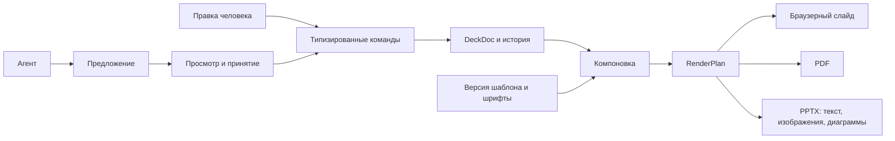

# Lanka: визуальное редактирование и PowerPoint

Дата: 6 сентября 2026. Статус: план следующей разработки по пожеланию владельца. Основания: `docs/prd/v2_0.md`, прежняя локальная приёмка и [живой тест экспортёров](EDITABLE_EXPORT_REVIEW.md). Реализованные возможности не смешиваются с пунктами ниже.

Актуальный продуктовый фокус — [PRODUCT_DIRECTION.md](PRODUCT_DIRECTION.md): красивый результат, скорость доводки и работа с агентом. Этот документ сохраняет детали визуального редактора; общий порядок уточнён в [пакете разработки](planning/README.md). Первый настоящий UI-цикл агента проверяется до завершения полной блочной редакции, параллельно с прямым вводом текста. Широкое покрытие PPTX не блокирует чат. Если выбранной команде необходим PowerPoint, проверка базовых объектов в нём начинается с первого среза.

Требование самостоятельного развёртывания и направление более свободной работы агентов заданы в [OPEN_WORKSPACE_STRATEGY.md](OPEN_WORKSPACE_STRATEGY.md). Описанные ниже презентационные контракты сохраняются в переносимом ядре. Создание нового компонента агентом развивается через изолированную рабочую копию и проверку; интерактивный HTML-пакет получает отдельный тип материала и честные ограничения экспорта. Общий реестр материалов не требует превращать DeckDoc в универсальную схему для всего.

## Продуктовый результат

Человек быстро получает красивую презентацию в стиле компании, меняет её прямо на слайде, видит сохранение и историю, обсуждает конкретный фрагмент с агентом, принимает нужные изменения и передаёт результат ссылкой или файлом. Для команд, которым нужен PowerPoint, файл пригоден для дальнейшего редактирования. Человек может закончить документ без агента.

Главные сущности интерфейса: **Папка → Презентация → Слайд → Выбранный элемент**. «Задача», «Выпуск», внутренние revision ID, JSON и стадия сборки не определяют основную навигацию. Согласование конкретной версии остаётся отдельной функцией для тех, кому оно нужно.

| Действие | Поведение редактора |
|---|---|
| Открыть документ | Слева миниатюры; в центре слайд; справа свойства выбранного элемента |
| Изменить заголовок/абзац | Двойной клик или Enter открывает ввод на месте; курсор, выделение, перенос строки, вставка и Escape работают привычно |
| Выбрать изображение | Рамка выделения; справа «Заменить», «Кадрировать», «Вписать/Заполнить»; изменение относится к изображению, а не ко всему слайду |
| Выбрать диаграмму | Выделяется диаграмма целиком; справа «Данные» с таблицей значений, единицами и источником; подпись числа не редактируется как независимый текст |
| Сохранить | «Сохраняем…» → «Сохранено» только после подтверждения сервера; при ошибке черновик остаётся, есть повторить и понятная причина |
| Попросить агента исправить | «Обсудить» открывает панель слева вместо миниатюр; видны привязка к документу/элементу, стадия и отмена |
| Посмотреть предложение | Изменённые фрагменты подсвечены, список конкретных правок и до/после; можно принять один блок |
| Посмотреть прошлое | «История» в шапке; ручные и принятые правки, сравнение и восстановление отдельной новой версией |
| Скачать | «Скачать PowerPoint»; при ограничении конкретного объекта — понятное сообщение перед созданием файла |

Мобильный режим использует ту же модель и те же предложения. Миниатюры, слайд и свойства показываются отдельными панелями, переход из комментария открывает именно сравнение. Удобное выделение текста и ввод проверяются на настоящем узком экране; уменьшенный desktop canvas сам по себе мобильным редактором не считается.

## Решение по архитектуре

Сохраняем ядро Lanka и существующую библиотеку. Развиваем общий план размещения, редактор блоков и PPTX-адаптер. HTML/CSS подходит для редактора и отображения; смысл документа остаётся в DeckDoc. У каждого поддерживаемого компонента есть контракт данных, разрешённые варианты и экспортная реализация.

**Первый редактор не требует замены всего SVG на HTML.** HTML-поле ввода можно разместить точно поверх логического текстового блока существующего SVG. После подтверждения меняется DeckDoc, запускается та же компоновка и поле закрывается. Это позволяет проверить непосредственное редактирование, сохранив проверенные Focus 3 preview/PDF. Полный HTML renderer вводится только если даёт измеримое преимущество на тех же фикстурах.

Предлагаемые внутренние компоненты: Text, Image, Chart, Table, Shape. Это имена типов в коде; пользователь видит обычные текст, изображение и диаграмму.

### Документ и идентификаторы

- DeckDoc хранит текст, числовые значения, asset/data/source refs и выбранные recipe/variant. DOM, PPTX и сгенерированные строки не становятся вторым редактируемым документом.
- Для текста нужен устойчивый `blockId`, для диаграммы — `seriesId` и `rowId`, для таблицы — ID строк/столбцов, для изображения — ID блока и неизменяемая ссылка на asset. ID не вычисляется из текста и не меняется при перестановке.
- На первом шаге read adapter v1 строит временное представление блоков: заголовок — `${slide.id}:title`, абзац — `${slide.id}:body`. Эти фиксированные поля устойчивы. Индексы массива не подходят для долгоживущих комментариев к строкам диаграммы.
- Для новых структурных блоков вводится схема v2 с явными ID и проверяемым переходом v1→v2 при включении нового редактора для выбранного документа. Старые сохранённые версии остаются в исходном формате; их чтение поддерживается адаптером. Автоматической массовой миграции нет.
- Богатый текст добавляется ограниченным AST: абзац, текст, разрешённые выделения/ссылка/список. Первый срез может редактировать plain text, сохраняя абзац целиком. Сырой HTML из буфера не записывается в документ.

### Общая компоновка

Текущий `Scene` обогащается до RenderPlan, а не заменяется независимыми экспортными координатами. Логический узел содержит `nodeId`, `blockId`, bounds, clip, порядок слоёв, разрешённые операции и полностью разрешённую типографику. Для текста дополнительно хранятся полный абзац/runs, строковый план, baseline, размер, семейство, вес и tracking. Для изображения — источник, intrinsic size и crop. Для диаграммы — числовые данные, геометрия области и стиль.

Координаты принадлежат результату компоновки; обычная команда агента по-прежнему не принимает x/y. Размеры изображения меняются в рамках разрешённого слота/варианта шаблона. Свободная композиция может стать отдельным режимом позже, с явным статусом соответствия шаблону.

Размер исходного canvas и перевод единиц фиксируются в одном месте. Сейчас это 1600×900; CSS px, pt и EMU не пересчитываются независимо каждым экспортёром. Компоновка выбирает шрифт, вес, переносы, отступы и слой один раз. Экспортёр не подставляет другой fontFace и не уменьшает текст через `fit: shrink`.

RenderPlan — производный кэш с ключом из хеша документа, версии шаблона, хешей assets/data/fonts и версии renderer. Повторный экспорт неизменённой версии использует те же зависимости. Возможная разница переносов текста в PowerPoint оценивается отдельно; общая геометрия не делает два текстовых движка идентичными.

### Редактирование и сохранение

- Edit session привязана к documentId, slideId, blockId и baseRevision. Ввод хранится в локальном draft, а не изменяет уже согласованную версию.
- Text commit меняет строку/AST; Chart commit меняет number с явным парсингом локального формата; Image commit меняет assetRef/crop. Одного универсального `setText(path)` для всех полей не будет.
- Композиция русского текста, IME, вставка нескольких абзацев и undo внутри текущего ввода завершаются до commit. Один смысловой commit — одна операция undo, а не история по каждому символу.
- Autosave ставит операции в последовательную очередь с operation/request ID. Повтор после сетевого сбоя идемпотентен. «Сохранено» относится к последнему подтверждённому состоянию, а не к отправленному запросу.
- При конфликте сохраняется локальный draft и предлагается сравнение. Обновление агента не перезаписывает активный ввод. Восстановление истории создаёт новую версию.
- При экспорте активный ввод сначала подтверждается и сохраняется; ошибка сохранения останавливает экспорт. Экспорт получает явный revision/hash. Файл из несохранённого состояния не маскируется под сохранённую версию.

### Диаграммы, изображения и PPTX

| Компонент | Браузер / PDF | PowerPoint | Проверяемое ограничение |
|---|---|---|---|
| Текст | Один логический блок, измеренные строки | Один text box на абзац/заголовок, несколько runs при необходимости | Кириллица, редактирование более длинного текста, шрифт на целевой машине |
| Изображение | Один asset + один crop/focal point | Отдельный image shape и эквивалентный crop | Смена пропорций, поворот/кроп только в поддерживаемом контракте |
| Столбчатая диаграмма | Общие data/bounds/style, векторное отображение | Native chart + embedded worksheet | Оси, подписи, цвета и слой проверяются в PowerPoint; визуальная разница документируется |
| Таблица | Типизированные строки/столбцы, общий размер | Native table | Сохранение структуры ячеек, переносов и ширины колонок |
| Прямоугольник/линия | Векторный узел | Native shape | Слой, цвет, границы |
| Сложная иллюстрация | SVG/растровый asset | Изображение, если нет адаптера | Сообщение «Иллюстрация будет изображением»; данные диаграммы не теряются молча |

Для первого среза достаточно обычной столбчатой диаграммы с одним рядом. Обработка отрицательных значений, нулей, подписей и единиц входит в тесты; комбинированные, stacked и анимированные диаграммы не обещаются до собственного адаптера.

Компонент компилируется один раз. Его PPTX-адаптер получает **тот же узел** и не рисует второй комплект фоновых/сервисных объектов. Нельзя сначала добавить native chart, затем поверх него выгрузить всю отрисовку того же chart-компонента. Это прямо следует из обнаруженного дефекта CreatPPT.

Экспорт возвращает файл и `capability report`: для каждого blockId — native text/image/shape/chart/table, flattened image либо unsupported, плюс причина и зависимость от шрифта. В пользовательском интерфейсе отчёт сводится к понятным ограничениям. Диаграмма, требующая редактирования данных, не считается успешной при замене на столбцы-фигуры.

Шрифты: фиксируем Plex и разрешённые замены, проверяем лицензии и целевые приложения. Пока встраивание PPTX не реализовано, нельзя обещать одинаковый вид на машине без шрифта. PDF сохраняет роль точного визуального экспорта; PPTX проходит свою приёмку. Уже установленный Focus 3 и прежнее ограничение на переключение defaultDesign сохраняются до приёмки.

### Агент, предложения и шаблоны

Чат создаёт run для конкретного документа, версии и выделенных блоков. Виден ход работы: «Разбирает запрос», «Готовит правки», «Проверяет слайды», «Готово к просмотру», «Остановлено» или ошибка. Отмена прекращает run, восстановление не создаёт дубликат предложения. Сохранение комментария и фактический запуск модели — разные события.

Предложения содержат типизированные операции по blockId и базовое значение/ревизию. Частичное принятие выполняется атомарно по блокам. Независимая ручная правка другого блока не должна блокировать всё предложение; совпадение блока требует явного сравнения. Существующее принятие по слайдам остаётся совместимым до появления нового формата.

История показывает изменения текста, данных, изображения/crop и композиции отдельно. Отображаются реальные до/после и связь с исходным замечанием. Комментарий к удалённому блоку сохраняет ссылку на прошлую версию и не «переезжает» на соседний элемент.

Агент может предлагать новый HTML/CSS/React-компонент **в процессе разработки шаблона**. Это отдельная версия пакета в репозитории, сборка, тесты и визуальная приёмка. Обычная MCP-сессия с документом выбирает установленный компонент/вариант и меняет данные. Модельный HTML не исполняется в редакторе клиента как доверенный шаблон. Это сохраняет INV-07/10 без запрета на разработку новых шаблонов.

## Порядок реализации

Работа идёт короткими демонстрируемыми срезами. После первого среза оцениваются фактическая скорость и объём следующих работ. Прежняя оценка 4–6 недель относилась только к локальному редактору и не служит сроком нового корпоративного продукта.

| Шаг | Объём / точки изменения | Приёмка |
|---|---|---|
| 1. Качество и логические блоки | `lib/domain/model.ts`, `scene.ts`, adapter v1; Focus 3; `scene-typography.ts`; корпус новых брифов | ID остаются при правке/перестановке; абзац собран в блок; старые fixtures/PDF не регрессируют. Люди оценивают целые новые деки, включая композицию и время доводки |
| 2. Непосредственная правка текста | `components/slide-canvas.tsx`, новый `inline-text-editor.tsx`, `project-workbench.tsx`, save queue, ProjectStore/human | Заголовок/абзац меняются на слайде, autosave/undo/Escape/IME, refresh и конфликт двух вкладок; desktop + mobile |
| 3. Сессия агента и предложения по блокам | Commands/proposals, `proposal-board.tsx`, `project-history.tsx`, runtime, workbench chat; адаптер разрешённого шлюза | Реальное поручение из редактора даёт видимый результат; обсуждение отличается от команды. Сначала текстовые блоки; ручная правка соседнего блока не теряется, cancel/resume не создают дубликаты |
| 4. Изображение и данные | `model.ts`, typed commands, inspector; asset API; Chart/Image nodes; предложения этих типов | Replace/crop переживают reload; 20→25 сохраняется числом; данные/источник и preview/PDF согласованы. Можно принять заголовок, отклонить crop, оставить chart pending |
| 5. PPTX по компонентам, если нужен команде | Разделить `lib/export.ts` на общую инфраструктуру и адаптеры text/image/chart/table; capability report | Заголовок одним textbox; фото с верным crop; диаграмма и workbook = 25/30/40; видимые слои; изменить в PowerPoint, сохранить и открыть повторно |
| На каждом срезе: пользовательский проход | Новая дека через MCP/агента в Focus 3, обычный редактор и мобильный просмотр, доступные форматы передачи | Человек без знания схемы находит документ, завершает поддерживаемую правку, понимает предложение и передаёт результат. Время и визуальная оценка записываются |

Если PowerPoint обязателен для пилота, минимальная проверка трёх объектов выполняется уже на шаге 1, а шаг 5 расширяет её покрытие. Без доступа к PowerPoint остальные работы продолжаются; экспорт не объявляется принятым только по LibreOffice/OOXML. Дополнительное изучение собственного редактора Presenton имеет смысл, если отвечает на конкретный оставшийся вопрос; обязательного ожидания такого исследования нет.

Корпоративные права, изоляция, хранение секретов и восстановление проектируются с первого среза и проверяются до работы с реальными клиентскими данными. Многопользовательская приёмка и материалы компании описаны в PRODUCT_DIRECTION; они не считаются выполненными локальным редактором.

**Первое изменение в продукте:** логический текстовый блок + непосредственная правка заголовка и абзаца на существующем Focus 3 с сохранением/undo; следующий срез связывает этот же блок с агентом и видимым предложением. Новый HTML-конвертер в основную ветку для этого не нужен.

Внешний конвертер имеет смысл подключать как отдельный адаптер только если испытания показывают преимущество, разрешено повторное использование, вход ограничен и результат проходит тот же отчёт возможностей. Полный перенос приложения Presenton или замена DeckDoc на CreatPPT scene сейчас не обоснованы.

## Сквозная приёмка следующего среза

Контрольный документ создаётся через MCP из содержания и зарегистрированных assets/data, без ручных координат. Для комбинированного теста нужен один новый разрешённый recipe «заголовок + изображение + диаграмма», а затем две короткие реальные деки. Технические числа не выдаются за исторические факты.

1. Смена заголовка, замена фото с другим соотношением сторон и число 20→25 через UI.
2. Autosave, перезагрузка; серверная версия содержит точные новый текст, hash фото, crop и number 25. Undo и redo проверяются отдельно.
3. Комментарий к диаграмме; реальная сессия агента предлагает правку двух блоков; принимается один. Человек видит принятый и оставшийся блоки и их происхождение.
4. PDF и PPTX экспортируют подтверждённую версию. OOXML проверяет textbox, отдельное фото, c:chart, workbook, значения, fonts, порядок слоёв и отсутствие дублирующего старого снимка поверх/под редактируемым содержимым.
5. В PowerPoint изменяются текст и значение через «Изменить данные», заменяется фото; файл сохраняется и повторно открывается. Проверяется полная видимость графика, переносы, crop, шрифты и отсутствие ручного восстановления композиции. Результат записывается с версией ОС/клиента и скриншотами.
6. Старые Focus fixtures, domain/integration проверки и default Focus 2 сохранены. Точные суммы/подписи/источники не переписаны ради успешного экспорта.
7. На мобильном доступны тот же документ, актуальная версия, комментарий, сравнение и решение по предложению.

Критерии нулевой терпимости: потерянные правки/данные, изображение вместо редактируемого обязательного графика, неверные числа, скрытый непрозрачным слоем объект, экспорт иной версии, потерянная привязка комментария. Визуальные допуски на baseline/переносы фиксируются на эталонном корпусе и целевых клиентах до автоматического принятия; один общий процент совпадения картинки для них недостаточен.

## Что остаётся в общей дорожной карте

Локальные папки уже работают, но не заменяют организации и серверные ACL. Права, изоляция и восстановление проверяются до корпоративного использования. Дизайн-пакет и связанная с документом сессия агента входят в ближайшие срезы. Источники, материалы компании и совместная работа развиваются для выбранного пилота; формальное согласование публикации включается по требованиям процесса. Полный порядок и проверка продуктовой ценности заданы в [PRODUCT_DIRECTION.md](PRODUCT_DIRECTION.md).

Импорт/синхронизация правок обратно из PowerPoint, произвольное HTML/CSS-авторство в пользовательской сессии, пустой свободный canvas, совместные курсоры, анимации и полный аналог Google Slides остаются отдельными решениями. Привычный сценарий редактирования можно проверить существенно раньше.
