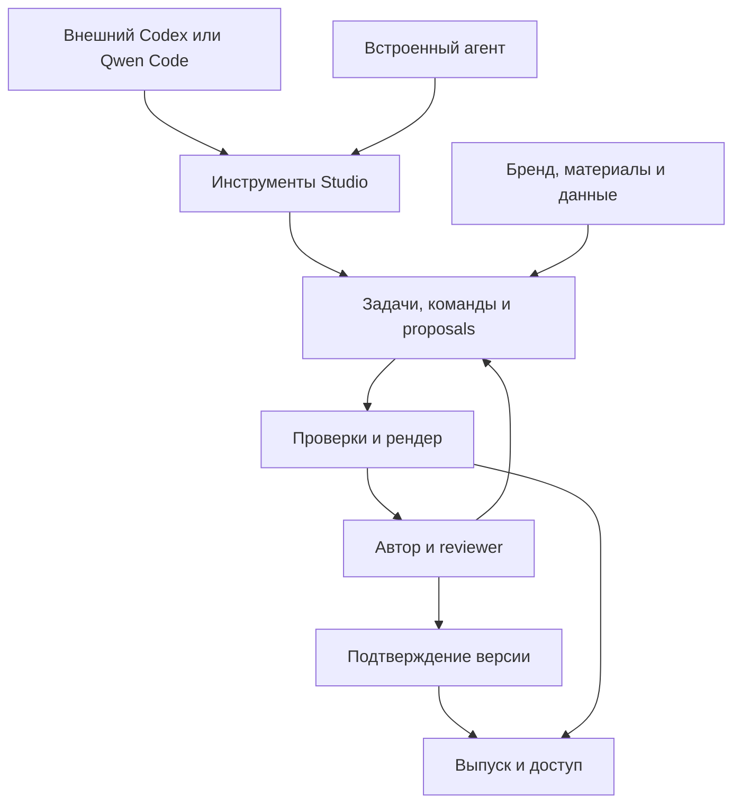

# Enterprise Presentation Studio: разбор и предложения к следующей версии

Дата: 4 сентября 2026 года. Статус: рекомендации для обсуждения и проверки в пилоте. Это отдельный разбор, который сам по себе не заменяет исходные PRD и не означает принятия архитектурных решений командой.

Изучены два документа:

- **D1:** `enterprise_presentation_studio_prd_architecture_v1_2(1).md`, версия 1.2.
- **D2:** `enterprise_presentation_studio_prd_v2_0_agent_led_review_first(1).md`, версия 2.0.

Ссылки вида «D2 §13» ниже относятся к разделам этих файлов. Существующие требования, найденные противоречия и новые рекомендации разделены явно. Актуальные возможности агентных платформ сверены с официальной документацией; интеграции и производительность практически не тестировались.

**Главная рекомендация — развивать корпоративное рабочее пространство, в котором разные агенты создают и обновляют презентации, а компания сохраняет контроль над брендом, содержанием, версиями и распространением.** Сильный агент должен повышать качество продукта без необходимости менять его ядро. Для этого нужны устойчивые контракты документа и операций, проверяемые результаты и удобное взаимодействие с человеком.

Текущие PRD уже хорошо описывают ревизии, предложения изменений, источники, бренд и воспроизводимый выпуск. Основные улучшения лежат в четырёх областях: свобода композиции, удобство повседневного редактирования, повторное использование корпоративного содержания и точная граница ответственности внешнего агента. Отдельная задача — сократить первый пилот до проверяемого рабочего сценария.

**1. Что сохранить из исходных документов.**

| Решение | Где описано | Почему сохраняем |
|---|---|---|
| Один канонический `DeckDocument` и производные форматы | D1 §4; D2 §6, §11–12 | Позволяет менять агента, интерфейс и экспорт без нескольких расходящихся оригиналов |
| Изменения через команды, ревизии и предложения | D1 §14; D2 §13, §21, §24 | Защищает человеческие правки и даёт понятную историю изменений |
| Brand Pack с человеческой сертификацией | D1 §9–11 | Отделяет предположение агента о бренде от принятого компанией правила |
| Смысловые блоки, привязки к данным и источникам | D1 §9; D2 §11, §20 | Сохраняет редактируемость и происхождение содержания |
| Единый путь авторитетного просмотра и PDF | D1 §13; D2 §17 | Позволяет проверять именно тот результат, который будет выпущен |
| Изолированные обработчики файлов, изображений и рендера | D1 §16–17; D2 §22–23 | Устанавливает реальные границы исполнения недоверенных материалов |
| Версионируемые навыки и оценки на корпусе задач | D1 §12, §22; D2 §14, §26 | Делает смену модели и инструкции измеримым изменением качества |
| Небольшой ручной редактор в первой версии | D1 §7; D2 §9 | Даёт возможность быстро исправить и завершить презентацию |
| Модульный монолит с отдельными тяжёлыми workers | D1 §17; D2 §22 | Соответствует транзакционным связям между документом, правами и согласованием |

Это уже имеющиеся сильные решения. Добавлять их повторно как новые функции следующей версии не требуется.

**2. Расхождения и незакрытые контракты, которые стоит исправить до разработки.**

| Приоритет | Наблюдение и привязка | Почему имеет значение | Предлагаемое решение |
|---|---|---|---|
| До фиксации PRD | Оба документа датированы 04.09.2026 и объявляют себя нормативными; D2 заменяет 1.0/1.1, но не упоминает 1.2, D2 §0 | Номер 2.0 сам по себе не определяет судьбу требований из 1.2 | Выпустить один согласованный PRD с явной таблицей переноса требований D1 |
| До фиксации PRD | D1 §9–11 описывает `BrandPackRelease`, authority материалов, evidence кандидатов, effective inheritance и weighted coverage; D2 §15–16 существенно сокращает эту модель | Есть риск реализовать загрузку шаблона и потерять управляемый онбординг бренда | Перенести доменную модель и правила сертификации из D1; сокращать UI, сохраняя данные и контроль |
| Продуктовый выбор | D2 §1, §26, §34 ориентируют продукт и главную метрику на PDF; пользовательская цель шире | Редактирование и обмен рабочими презентациями могут требовать другого пути завершения | Зафиксировать первый рабочий процесс и обязательные форматы получателя |
| Продуктовый выбор | External sharing указан в P0, D2 §5.5 и PR-ORG-004; в D2 §35.8 необходимость ещё открыта; D1 относит к P1 | Разные объёмы прав, гостевого доступа и реализации | Для первого пилота явно выбрать internal-only либо конкретный сценарий внешнего доступа |
| P0 | `templateRef` находится в изменяемом `DeckRecord`, D2 §11.2, хотя approval относится к полному fingerprint, §6 и §17 | Показанный тип не гарантирует сохранение шаблона каждой исторической ревизии | Описать immutable revision envelope с точными версиями бренда, шаблона и зависимостей |
| P0 | `MetricBlock` допускает одновременно `value: string` и `dataBindingId`, D2 §11.3 | Текстовая цифра и значение привязки могут разойтись | Для привязанных показателей вычислять отображение из typed value; ручное значение — отдельный режим |
| P0 | Source coverage и source IDs хорошо определены, D2 §20, но наличие ссылки не доказывает утверждение | Неверная интерпретация источника может пройти структурную проверку | Разделить ссылочную полноту, точность извлечения и смысловую подтверждённость |
| P0 | Зависимости change groups указаны в D2 §11.5 и §21.3 | Независимые записи могут быть смыслово связаны: график и вывод на другом слайде | Добавить серверный анализ зависимых показателей и пометки выводов, требующих повторной проверки |
| P0 | D2 §23.3–23.4 обещает ограничения сети и провайдеров, но внешний агент находится вне среды сервиса | MCP-сервер не контролирует дальнейшую отправку уже выданного текста | Разделить управляемые runtimes и внешние клиенты; применять политику до выдачи данных |
| P0 | D2 §14 предполагает исполнение одних навыков встроенными и внешними агентами | Внешний агент может пропустить инструкцию или сообщить неверную версию модели | Обязательные проверки выполняет сервер; заявления клиента помечаются как self-reported |
| P0 | Cancellation best-effort, D2 §13.5 | Поздний ответ worker может записать изменения после остановки задачи | Немедленно запрещать новые записи отменённой задачи; завершение внешнего вычисления учитывать отдельно |
| P0 | Пример `apply_commands` содержит accepted/rejected commands, D2 §13.3; command groups должны быть атомарными, §21.3 | Неочевидно, возможна ли частично выполненная зависимая группа | По умолчанию транзакция all-or-nothing; частичное выполнение только между явно независимыми группами |
| P0 | `CommentThread.status` содержит open/resolved, D2 §11.7; §21.4 описывает ещё addressed/applied | Обработчики UI и сервера могут реализовать разные состояния | Сохранить open/resolved как состояние треда и отдельно хранить состояние предложенного исправления |
| Пилот | D2 §7.1 и §36 требуют число recipes; D1 §11.4 считает главным покрытие реальных случаев | Можно выполнить количественный норматив и не покрыть ключевые презентации | Приёмка по покрытию и качеству; число recipes использовать как оценку трудоёмкости |
| Пилот | В D2 §11 есть `speaker-led`, но presenter mode отложен в §7.3 | Заявленный сценарий выступления требует способа показывать слайды | В P0 достаточно полноэкранного показа и клавиш навигации либо согласованного внешнего средства показа |

Отдельно следует выбрать единую форму хранения слайдов: D1 использует map слайдов и списки ID, D2 — вложенные массивы. Оба варианта допустимы. Для многочисленных адресных правок удобны стабильные ID, явные списки порядка и единые операции перемещения. Это инженерный выбор после проверки размера документов и удобства diff.

**3. Как развитие агентов влияет на архитектуру.**

| Подтверждённая возможность на дату разбора | Следствие для Studio |
|---|---|
| Codex поддерживает MCP, включая Streamable HTTP и OAuth | Внешний Codex может работать с продуктовым сервером инструментов; собственный диалоговый интерфейс не обязан быть единственной точкой входа. [Официальная документация MCP в Codex](https://learn.chatgpt.com/docs/extend/mcp?surface=cli) |
| Codex SDK позволяет программно запускать и продолжать задачи; App Server рассчитан на более тесную интеграцию интерфейсов | Можно оценивать готовую агентную среду как сменяемый адаптер встроенного исполнителя. [Codex SDK](https://learn.chatgpt.com/docs/codex-sdk), [App Server](https://learn.chatgpt.com/docs/app-server) |
| Qwen Code предоставляет MCP и TypeScript SDK, включая работу с инструментами и прерывание задач | Второй клиент следует включить в проверку переносимости вместо предположения, что совместимость с одним клиентом достаточна. SDK обозначен документацией как experimental. [Qwen Code MCP](https://qwenlm.github.io/qwen-code-docs/en/developers/tools/mcp-server/), [Qwen Code SDK](https://qwenlm.github.io/qwen-code-docs/en/developers/sdk-typescript/) |
| MCP Apps описывает интерактивные интерфейсы внутри поддерживающего их host | Галерею слайдов, выбор изображения или краткий diff можно показывать внутри разговора. Поддержка конкретным клиентом проверяется отдельно; web review link остаётся базовым путём. [MCP Apps](https://modelcontextprotocol.io/extensions/apps/overview) |

В документации App Server отдельно отмечена экспериментальность и неподдерживаемость WebSocket transport для production. Наличие API нельзя считать готовой многопользовательской инфраструктурой. Для пилота нужно закрепить версии и проверить изоляцию, восстановление, ограничения расходов и модель доступа. [Ограничения App Server](https://learn.chatgpt.com/docs/app-server)

**Архитектурный вывод, а не прогноз гарантированных возможностей:** по мере улучшения моделей ценность ручного программирования каждого шага подготовки слайда может снижаться. Корпоративные данные, подтверждённые правила бренда, история решений, проверенные операции и качество результата сохраняют значение при смене исполнителя.

Практически полезно предусмотреть два способа работы:

| Способ | Кто ведёт задачу | Что делает Studio | Граница контроля |
|---|---|---|---|
| Пользователь работает внутри Studio | Встроенный сменяемый runtime | Даёт задачи, контекст и инструменты; показывает прогресс, результат и исправления | Можно контролировать среду, маршруты моделей и исполнение операций |
| Пользователь работает в Codex/Qwen Code | Внешний агент клиента | Предоставляет разрешённые данные, черновик, проверку, рендер и просмотр | Сервис контролирует собственные ответы и записи; поведение внешнего процесса контролирует его владелец |

Оба способа создают одинаковые ревизии, proposals и результаты проверок. Совпадение текста рассуждений, числа вызовов или внутреннего устройства агента не требуется.

**4. Более свободная композиция при сохранении корпоративного бренда.**

Recipes полезны как качественные стартовые решения. Проблема возникает, когда весь язык презентаций ограничен конечным каталогом страниц. Сильный агент может придумать хорошее объяснение, которому потребуется новая комбинация привычных компонентов.

Предлагается три уровня возможностей:

| Уровень | Разрешение | Проверка | Когда нужен |
|---|---|---|---|
| Готовый recipe | Заполнить типовые слоты, выбрать разрешённый вариант | Обычные проверки контракта | Основная масса слайдов первого пилота |
| Композиция из сертифицированных компонентов | Собрать row/stack/grid, связать текст, график, схему, изображение; задать допустимые пропорции и приоритеты | Геометрия, типографика, доступность, бренд и лимиты сложности | Повторяющиеся нестандартные случаи; небольшой технический эксперимент до фиксации схемы |
| Новый компонент или recipe | Предложить расширение языка дизайна | Изолированная подготовка, fixtures, просмотр дизайнером и человеческая сертификация | Когда разрешённые компоненты недостаточны |

Второй уровень — декларативное дерево композиции. Оно может задавать сетку, относительные размеры, выравнивание, порядок чтения, разрешённое наложение и ссылки на дизайн-токены. Итоговые координаты вычисляет renderer. Состав и свобода этого дерева должны быть ограничены проверяемой схемой.

Код, созданный coding agent, допустимо использовать как временный способ подготовить данные или кандидата компонента в изолированной среде. В продукт принимается проверенное декларативное представление или сохранённый ассет. Для произвольного runtime-кода понадобится отдельное архитектурное решение; это не обязательная функция P0.

Для проверки выразительности достаточно взять два сложных слайда клиента — например, продуктовую архитектуру и сравнение нескольких сценариев — и попробовать собрать их из ограниченного набора примитивов. Если для каждого требуется новый тип в ядре, язык слишком узок. Если проверять допустимость результата практически невозможно, он слишком широк.

Полезно также изменить порядок автоматического исправления переполнения: сначала варианты композиции и допустимые пропорции, затем предложение изменить структуру, и только затем сокращение текста. В D2 §14.4 сокращение идёт очень рано. Смена формулировки ради размера может менять смысл. Для защищённых утверждений, чисел и согласованных формулировок сокращение должно требовать отдельного видимого предложения.

**5. Повседневное редактирование должно быть быстрым.**

Требование human-final стоит сохранить. При этом отдельное подтверждение каждого низкоуровневого действия создаёт дополнительную работу. D2 INV-04 уже допускает policy-исключения для low-risk automation; следующей версии нужно превратить это в понятный продуктовый режим.

| Состояние работы | Предлагаемое поведение |
|---|---|
| Личный рабочий черновик | По заданию автора агент обновляет рабочую ветку, показывает изменения сразу и сохраняет undo/checkpoint |
| Совместная версия или содержательная правка другого автора | Агент готовит proposal; человек принимает смысловую группу изменений |
| Версия на согласовании | Изменения создают новую ревизию; актуальность согласований пересчитывается |
| Выпуск или сертификация бренда | Явное действие уполномоченного человека над конкретной проверенной версией |

Автоматическое применение в черновик допустимо только в пределах понятной задачи и разрешённой области. История и просмотр diff сохраняются. Человек может держать все изменения в режиме предложения.

Пример задачи: «Сократи слайды 4–6, цифры и юридическую оговорку сохрани; покажи два варианта схемы». Для неё полезен устойчивый `EditTask`: цель, целевые слайды, защищённые блоки, разрешённые виды изменений, базовая ревизия, бюджет и условия завершения.

Нужно разделить два вида ограничений:

- Проверяемые сервером: не менять указанные ID, значения, источники, разрешённый набор слайдов и версии ассетов.
- Смысловые: сохранить интонацию, не ослабить вывод, объяснить проще. Они требуют сравнения, оценки и человеческого решения; схема сама их не доказывает.

Комментарии, принятые решения и область задачи должны жить в продукте. При замене Codex на Qwen Code следующий исполнитель получает текущую ревизию, активную задачу, ограничения и нерешённые вопросы. Передавать скрытые рассуждения предыдущей модели для этого не нужно.

Просмотр изменений лучше группировать по пользовательскому смыслу: «обновлены результаты августа», «перестроен аргумент на слайдах 4–6», «добавлен кейс». Внутри остаётся подробный diff. Для черновика полезны selection → короткая команда, адресный комментарий, undo и два варианта одного слайда. Весь набор проверок деки не должен запускаться на каждую опечатку; локальная проверка и полный preflight решают разные задачи.

**6. Повторное использование готового содержания.**

В текущих документах хорошо описаны Brand Library, ассеты, источники и lineage. Библиотека актуального корпоративного содержания требует отдельного контракта. Это полезная часть именно обмена презентациями между командами.

Минимальный объект `ContentRelease` может представлять один слайд или небольшой раздел: описание продукта, проверенный клиентский кейс, объяснение архитектуры, утверждённую формулировку. Он хранит владельца, версию, допустимые аудитории, доступ, дату актуальности, источники и происхождение.

Агент должен уметь искать по задаче: «Найди актуальное описание продукта для руководителя клиента» или «Возьми проверенный кейс из прошлой презентации». При вставке используются immutable версии с сохранением происхождения. Если владелец обновил материал, другие деки получают предложение обновления; опубликованные файлы не меняются.

Право посмотреть слайд не следует автоматически считать правом распространять все его исходные материалы. При копировании проверяются зависимости и классификация. Для внешней аудитории создаётся отдельная проверяемая редакция; убрать видимый блок недостаточно, если внутренние сведения остаются в notes, вложениях, данных графика или скрытых объектах экспорта.

Для P0 достаточно выбрать и переиспользовать слайды из доступного предыдущего выпуска, сохранив lineage. Общий каталог, массовые уведомления об обновлении и аналитика использования могут появиться после пилота.

**7. Связь цифр, формулировок и источников.**

Единый AST решает целостность документа, но не устраняет дублирование одного факта в нескольких местах. Показатель может одновременно находиться в карточке, графике и заголовке. Обновление графика не гарантирует обновления вывода.

Пример: в старой версии заголовок говорит о росте, новый snapshot показывает снижение. Каждая ссылка на источник корректна, layout чистый, но презентация противоречива.

Предлагаемый минимальный контракт:

- `FactRef` связывает показатель с версией snapshot, ячейкой или сегментом источника, единицей и периодом.
- Привязанные `MetricBlock` и числовые вхождения в rich text получают отображаемое значение из одного typed value. Форматирование отделено от значения.
- Расчётные показатели используют ограниченные детерминированные формулы с явными входами, единицами, округлением и обработкой нулевого знаменателя.
- Ручная оценка или прогноз представлены явным типом с автором и основанием; это не молчаливый override вычисленного значения.
- `Claim` хранит формулировку, основание, связанные показатели и состояние проверки. Изменение основания помечает зависимый вывод как требующий пересмотра.

Полный корпоративный knowledge graph для этого не нужен. Начать можно со связей в пределах одной презентации и её прошлой версии.

В проверках следует различать: существует ли ссылка; верно ли извлечено число; совпадают ли период и единица; подтверждает ли материал вывод. Последний вопрос часто требует модели и человека. Статус «есть источник» нельзя показывать как «истина проверена».

При частичном принятии proposal сервер определяет зависимые изменения по реальным ссылкам. Для автоматических значений обеспечивает согласованность; для смысловых выводов требует повторного просмотра. Декларируемый агентом `dependsOn` полезен, но недостаточен как единственное основание.

**8. Контракт с агентом: свобода выполнения, проверка результата.**

Набор инструментов в D2 §13 — хорошая основа. Улучшение состоит в том, чтобы агент получал достаточно информации для качественной правки и не должен был многократно пересылать всю презентацию.

| Операция | Что полезно возвращать или проверять |
|---|---|
| Обнаружение возможностей | Версии схем и команд, допустимые outputs, лимиты, поддерживаемые способы получения изображений и статуса |
| Контекст задачи | Brief, план презентации, текущую область редактирования, protected IDs, связанные комментарии, разрешённые источники и ссылки на детали |
| Отправка изменения | Адресные операции, base revision, ожидаемые значения изменяемых полей, task ID, idempotency key и понятное человеку объяснение |
| Рендер | Изображения изменённых слайдов, сопоставление pixels → block ID, измеренные ошибки и варианты допустимого исправления |
| Проверка | Серверный отчёт по точному fingerprint, отдельные результаты структурных, числовых и модельных проверок |
| Передача на review | Proposal, смысловые группы изменений, нерешённые вопросы и ссылка на просмотр |
| Продолжение задачи | Сохранённый checkpoint, актуальная ревизия, ограничения и результаты уже завершённых шагов |

Необязательно создавать новый tool для каждой строки. Можно развить `get_deck_context`, `apply_commands`, `render`, `lint`, `submit_proposal`, сохранив небольшой каталог. На уровне MCP нужны хорошо описанные tools; SDK/CLI являются адаптерами этого контракта.

YAML-проекция полезна для файлового workflow, но её обязательность в первых PR стоит пересмотреть. D2 §31 ставит проекцию раньше вертикального пользовательского сценария. Сначала можно доказать создание и редактирование через типизированные операции, затем сравнить их с YAML на реальных задачах по качеству, числу ошибок и объёму контекста. Для той части продукта, где YAML поддерживается, требования round-trip и единого канона остаются обязательными.

Сильный агент может сам выбирать путь: найти готовый слайд, создать структуру, запросить данные, написать вспомогательный скрипт в разрешённой среде. Навык описывает хороший способ работы и ограничения. Право изменения, валидность документа и готовность к выпуску определяет сервер.

Сервер не должен доверять тексту «я выполнил deck-render и проверил все слайды». В состоянии proposal хранится результат реальной проверки сервиса с fingerprint и версией проверяющего кода. После изменения соответствующих входов эта проверка устаревает. Версия навыка и модели внешнего клиента может быть self-reported; в управляемой среде её можно фиксировать инфраструктурой. Это разные уровни доказательности.

Для смены исполнителя достаточно стабильного `TaskCheckpoint`. Продвинутая многоагентная оркестрация не нужна для P0. Если позже несколько исполнителей работают над разными слайдами, они отправляют независимые proposals относительно явно заданной базы. Согласованность общих фактов и итогового повествования проверяется при объединении.

**9. Реальные границы контроля внешнего агента.**

`allowedProviders` внутри Studio управляет запросами, которые делает сам Studio. Если MCP уже выдал секретный текст локальному клиенту, сервер не может гарантировать, что клиент отправит его только разрешённой модели. Поле `model: approved-model` в запросе не доказывает маршрут данных.

Практическая схема:

| Исполнитель | Возможный доступ | Что необходимо для заявленной гарантии |
|---|---|---|
| Управляемый worker Studio | Данные по правилам tenant | Изоляция процесса, разрешённые endpoints, учетные данные через broker, ограничения egress |
| Корпоративный runtime клиента | Данные по согласованному классу доверия | Контролируемое развёртывание и идентичность установки, договорённые механизмы маршрутизации и наблюдаемости |
| Неуправляемый внешний клиент | Только классы данных, разрешённые для такого получателя | Авторизация и фильтрация каждого ответа до передачи; нельзя обещать контроль дальнейшего использования |

Проверка требуется не только для API текста. Те же правила относятся к preview-картинкам, thumbnails, извлечённым таблицам, комментариям и signed URLs. Отозвать grant означает прекратить будущие чтения и записи в пределах заданного SLA. Уже скачанные данные от этого не исчезают.

При работе с downstream-системами не следует пересылать произвольный клиентский токен как универсальное доказательство полномочий: нужно проверять аудиторию токена и разграничивать доступ к Studio и к источникам. Это соответствует рекомендациям MCP по token passthrough. [MCP Security Best Practices](https://modelcontextprotocol.io/docs/draft/tutorials/security/security_best_practices)

Отмена задачи имеет два независимых результата: сервис перестал принимать изменения от этого run; внешний provider прекратил вычисление и списания, если его интерфейс это позволяет. Для первого достаточно серверного состояния run и fencing/epoch-проверки на commit. Второе может оставаться best-effort. При тайм-ауте генерации статус может быть `unknown`; повторять платный запрос безопасно только с учётом поддерживаемой provider-idempotency либо после выяснения исхода.

**10. Brand Onboarding и изображения.**

D1 здесь сильнее D2. В следующую версию следует перенести `BrandPackRelease`, явную авторитетность материалов, evidence, решения дизайнера и компиляцию effective release. Внедрение через интегратора и минимальный интерфейс не требуют отказа от этой модели.

Дополнительно полезны четыре вещи:

1. Разделить правила бренда на машинно проверяемые, требующие оценки дизайнером и рекомендательные. Например, наличие логотипа проверяется иначе, чем «изображение передаёт уверенность».
2. Проверять покрытие на отложенных материалах, которые не использовались для настройки recipes. Иначе можно хорошо воспроизвести примеры и плохо работать на следующей презентации.
3. Связывать исправления пользователя с причиной: плохой brief, неподходящий recipe, неверная интерпретация бренда или ограничение renderer. Это позволяет улучшать нужный слой системы.
4. Извлекать предпочтения из повторяющихся правок как кандидаты. Личное предпочтение автора не становится правилом всего бренда без решения уполномоченного человека.

Для изображений уже есть хороший `VisualIntent` и provider broker. Следующее улучшение — планировать изображение вместе с местом на слайде: соотношение сторон, положение главного объекта, пустое пространство для текста, совместимость обрезки и общая стилистика серии. Нужно позволять выбрать кандидат, попросить локальное изменение и сохранить предыдущую версию.

Серверное добавление брендовых ограничений в prompt не гарантирует, что генератор их выполнит. Машинно проверяемые свойства проверяются после генерации; уместность и визуальное соответствие — моделью и человеком. Точные диаграммы, числа, подписи и редактируемые схемы остаются структурными объектами. Выбранные изображения сохраняются как неизменяемые ассеты, как уже предусмотрено обоими PRD.

**11. Шеринг, показ и форматы результата.**

Для продукта из пользовательского запроса полезны три явных объекта доступа:

| Объект | Для чего предназначен | Поведение |
|---|---|---|
| Рабочая презентация | Совместная подготовка | Актуальные ревизии, комментарии и назначенные права |
| Версия на согласовании | Проверка конкретного результата | Фиксированная ревизия и видимые изменения относительно предыдущей |
| Выпущенная версия | Передача адресату и последующее использование | Неизменяемый artifact и доступ по установленной политике |

Ссылка на согласование не должна незаметно показывать следующую ревизию. Ссылка «последний выпуск» может существовать отдельно, с явным названием и возможностью открыть историю.

Для внутренних презентаций полезны полноэкранный просмотр, комментарии без установки agent client и право создать производную версию. Для внешнего обмена — отдельная разрешённая редакция, а не просто публичная ссылка на внутренний draft. Отзыв ссылки прекращает доступ через сервис; скачанный PDF или PPTX технически не отзывается.

С учётом цели удобного редактирования в крупных организациях я бы включил **ограниченный редактируемый PPTX-экспорт в проверку первого пилота**. Его можно отложить только для явно выбранного процесса, где пользователи согласны завершать работу ссылкой или PDF.

Это не требует превращать PPTX в канонический формат. Минимальный exporter поддерживает текст, базовые фигуры, изображения и заранее выбранные типы таблиц/графиков. Для остальных объектов показывает статус: native editable, grouped vector, raster, unsupported. Если критический объект становится картинкой, это продуктовая потеря, которую надо измерить.

До большого объёма разработки нужен эксперимент: взять несколько реальных слайдов, экспортировать, открыть в используемом клиентом PowerPoint и выполнить обычные правки. Отдельно проверить шрифты, переносы, обрезку изображений, chart data, редактируемость и повторное открытие. PDF и PPTX имеют разные пути рендера; совпадение не следует из общего AST.

Импорт произвольной старой презентации — отдельная сложность. Для пилота допустимы PPTX как источник, реконструкция выбранных слайдов и явные неподдерживаемые объекты. Обещание полного двустороннего round-trip преждевременно. Повторно загруженный изменённый PPTX должен проходить reconciliation или создаваться как новая ветка с отчётом, а не молча заменять текущий документ.

Самое дорогое исходное решение — собственные формат, layout и renderer. Его стоит проверить сравнением двух небольших прототипов до фиксации инвариантов. Более сильные coding agents делают работу с файлами естественной точкой интеграции; выгоду семантического AST всё равно нужно доказать на реальном процессе. Следующая таблица отражает ожидаемые архитектурные компромиссы, а не результаты проведённого benchmark.

| Путь | Где выглядит уместным | Главная проверяемая сложность |
|---|---|---|
| `DeckDocument` + управляемый renderer, как в PRD | Повторяемые отчёты, строгий бренд, адресное обновление, понятные смысловые изменения | Выразительность схемы, качество своего layout и стоимость экспорта |
| PPTX как оригинал + извлечённый семантический индекс + версии файлов | Процесс, в котором пользователи постоянно продолжают работу в PowerPoint | Устойчивые anchors, содержательный diff, слияние агентных и ручных изменений, визуальная проверка |

Для второго пути PPTX был бы каноном, а индекс — восстанавливаемым производным представлением. Два независимых оригинала не появляются. Это альтернативное архитектурное решение и потребует изменения ADR, а не незаметного добавления ещё одного режима в текущее ядро.

Я бы оставил `DeckDocument` основным кандидатом для предложенного регулярного отчёта, но поставил явный checkpoint: на одинаковых материалах сравнить качество результата, адресные исправления, редактируемость у получателя и стоимость реализации. Если почти вся ценность клиента зависит от продолжения работы в PowerPoint, результат этой проверки может изменить выбор канона. До такого сравнения утверждение, что собственный renderer обязателен для бизнеса, преждевременно.

**12. Предлагаемая архитектурная схема.**

Выпуск требует одновременно действительного человеческого подтверждения, подходящих прав и проверок того же fingerprint. Стрелка от рендера не является самостоятельным разрешением публикации.

Предлагаемые уточнения сущностей:

| Сущность | Ответственность | Объём первого пилота |
|---|---|---|
| `DeckRevision` | Неизменяемый AST и точные ссылки на бренд, шаблон и зависимости | Обязательно |
| `EditTask` | Цель, область изменений, ограничения, состояние и checkpoint | Минимальные поля для продолжения и остановки |
| `Proposal` / `ChangeGroup` | Проверяемые изменения относительно базы и их принятие | Уже предусмотрено; уточнить атомарность и зависимости |
| `ValidationResult` | Серверный результат проверки конкретных входов | Обязательно; модельные результаты отделены |
| `BrandPackRelease` | Сертифицированный эффективный набор правил и компонентов | Восстановить из D1 |
| `FactRef` / зависимости выводов | Числовая согласованность и область повторной проверки | В пределах одной деки и прошлой версии |
| `ContentRelease` | Повторно используемый слайд или раздел | Сначала snapshot выбранного материала с lineage |
| `Release` / `Approval` | Точная подтверждённая версия и выданные результаты | Обязательно |

`DeckRevision` должен фиксировать content hash, Brand Pack release, template package versions, используемые snapshots и assets. Renderer и результаты preflight фиксируются в build/release manifest; approval должен ссылаться на проверенный fingerprint. Смена этих входов требует нового результата проверки и соответствующего согласования.

Исторические данные и артефакты остаются неизменяемыми. При новой публикации отдельно проверяются текущие права и политики: ранее допустимый asset может быть отозван. Воспроизводимость истории не означает бессрочное разрешение на новое распространение.

**13. Первый пилот: один регулярный рабочий процесс.**

Рекомендуемая стартовая гипотеза — регулярный продуктовый или управленческий отчёт одной команды. Здесь можно измерить создание первой версии, обновление цифр, изменение выводов и исправление замечаний. Board-процесс из PRD возможен, но его многоступенчатое согласование может затруднить раннюю проверку удобства.

Демонстрационный сценарий:

1. Команда предоставляет прошлую презентацию, текущие данные, несколько примеров бренда и задачу следующего отчёта.
2. Интегратор и дизайнер создают первый Brand Pack; дизайнер его сертифицирует.
3. Автор просит встроенного агента подготовить обновление: сохранить удачные слайды, заменить данные, пересмотреть изменившиеся выводы.
4. Агент показывает первые готовые страницы, источники и вопросы; автор может уточнить задачу в процессе.
5. Reviewer оставляет замечание на графике. Агент делает адресную правку и показывает изменившийся вывод.
6. Автор вручную меняет заголовок, пока агент работает. Изменение сохраняется либо возникает явный конфликт.
7. Подключённый Codex или Qwen Code продолжает отдельную правку через тот же контракт.
8. Коллега открывает ссылку, проверяет результат и принимает смысловые группы изменений.
9. Уполномоченный пользователь выпускает результат. Если процесс требует PowerPoint, получатель открывает PPTX и выполняет обычную правку.
10. На следующем цикле команда обновляет эту презентацию повторно и проверяет, сохраняется ли экономия времени.

Рабочие ограничения пилота:

- Один реальный клиентский бренд; внутренний эталонный набор оставить для тестов.
- Один основной тип отчёта, русский и/или английский в соответствии с пользователями.
- Примерно 6–8 нужных семейств слайдов как начальная оценка, без жёсткой нормы количества.
- Ограниченный набор входных форматов, выбранный по реальным материалам. Остальные показывают явный unsupported/partial статус.
- Один встроенный runtime; базовая совместимость инструментов с Codex и Qwen Code. Полная матрица версий растёт после пилота.
- Snapshot-файлы с данными и ручной запуск обновления; scheduler и широкий каталог connectors позже.
- Internal sharing и понятный финальный output. Внешний доступ включать только при необходимости пилотного процесса.
- Изображения через один разрешённый provider, если выбранные задачи требуют генерации; брендовые ассеты и структурные схемы поддерживаются в любом случае.

Таким образом, часть требований исходного P0 сознательно становится более узкой. Это предложенное изменение scope, которое следует отразить в следующем PRD. Качество изоляции, версии и достоверность проверки при этом остаются обязательными.

**14. Порядок работы и условия принятия решений.**

| Этап | Конкретный результат | Критерий перехода |
|---|---|---|
| Проверка рабочего процесса | Реальные материалы, конечный получатель, обязательный output, baseline времени | Понятно, где продукт будет использоваться повторно |
| Технические эксперименты | Один слайд end-to-end; сложная композиция; экспорт; импорт источника; конфликт правок | Риски форматов и языка документа видны до фиксации модели |
| Вертикальная версия | Brief/прошлая дека → агент → правка → комментарий → выпуск | Обычный пользователь проходит процесс без участия разработчика |
| Повторный пилотный цикл | Та же команда готовит следующий отчёт | Экономия времени сохраняется на обновлении и исправлениях |
| Расширение | Дополнительные сценарии, self-service onboarding, интеграции | Есть подтверждённая повторяемая ценность и понятная стоимость внедрения |

В D2 §30 названы 2–3 недели spikes, затем 8–12 недель разработки, затем 4–8 недель пилота. Эти сроки являются плановой оценкой, а не результатом проверки данной архитектуры. По документам нельзя подтвердить их достижимость. Наибольшая неопределённость связана с качеством рендера на реальных брендах, PPTX, извлечением данных и удобством исправлений.

Новая модель или новый runtime проходит существующий eval-корпус. Дополнительно полезно сравнивать три режима: фиксированный workflow, агент со свободой выбора инструментов, и файловый workflow. Выбор следует делать по результатам принятых задач, количеству человеческой работы, стоимости и сохранению инвариантов.

**15. Что измерять.**

Главный результат: количество презентаций, реально использованных коллегами, и человеческое время на их подготовку и согласование. Время до PDF полезно, но не учитывает уход пользователя в PowerPoint для завершающих правок.

| Метрика | Как считать |
|---|---|
| Активные минуты человека до принятого результата | Подготовка данных, команды агенту, просмотр, ручные правки и доведение в другом редакторе; ожидание считать отдельно |
| Экономия времени | Сравнение сопоставимых задач одной команды с одинаковыми входными материалами и критерием готовности |
| Доля завершённых задач | Все начатые задачи в знаменателе, включая failed, needs-input и брошенные |
| Повторное использование | Возвращается ли команда на следующий реальный отчёт; отдельно от открытия красивого demo |
| Адресность правок | Доля изменений внутри заданной области; случаи ненужной перегенерации соседних страниц |
| Корректность исправлений | Замечание устранено, связанные цифры и выводы согласованы, новые ошибки не добавлены |
| Время Brand Onboarding | Все часы интегратора, инженера и клиентского дизайнера, включая исправления после первой деки |
| Покрытие бренда | Качество на отложенных презентациях и частых критичных случаях, а не только на обучающих референсах |
| Совместимость выхода | Доля задач, где получатель может показать, редактировать и переиспользовать результат без восстановления вручную |
| Полная стоимость принятой презентации | Модели, изображения, OCR, рендер, инфраструктура, помощь внедрения и человеческий review |

Пример стартовой гипотезы: медианное активное время человека снижается хотя бы вдвое на выбранном рабочем процессе. Это предлагаемый порог пилота, не рыночное обещание. Требование отсутствия критических ошибок проверяется на конкретном корпусе и реальных результатах; небольшой пилот не доказывает нулевую вероятность ошибки.

В оценку стоит включить повторный update, бессмысленные правки вне запроса, конфликт с ручным редактированием, отмену с поздним ответом, смену исполнителя, неверную цитату при правильной ссылке и частичное принятие связанных изменений. Эти случаи непосредственно проверяют качество агентного редактирования.

**16. Приоритетные изменения для следующего PRD.**

| Очерёдность | Предлагаемая правка | Результат |
|---|---|---|
| 1 | Объединить нормативную версию и вернуть Brand Onboarding из D1 | Команда реализует один согласованный контракт |
| 2 | Зафиксировать конкретный пилотный процесс и конечный формат | P0 проверяет реальное редактирование и обмен |
| 3 | Уточнить revision envelope, числовые привязки, атомарность и зависимости | История, данные и partial acceptance согласованы |
| 4 | Ввести явную область задачи, защищённые объекты, checkpoint и отмену записей | Агент делает адресные правки и переживает смену исполнителя |
| 5 | Разделить обычный черновик, совместное review и выпуск | Пользователь получает скорость без потери истории и контроля |
| 6 | Зафиксировать границу управляемых и внешних runtimes | Обещания о провайдерах, аудите и egress соответствуют реальному контролю |
| 7 | Проверить композиционный язык и минимальный PPTX на материалах клиента | Ограничения форматов известны до большой реализации |
| 8 | Включить повторный отчёт и переиспользование выбранных слайдов в пилот | Проверяется ценность второго и последующих применений |
| 9 | Сократить обязательные инфраструктурные поверхности и UI до нужного сценария | Срок первой проверки гипотезы уменьшается |
| 10 | Измерять человеческую работу, повторное использование и полную стоимость | Решения о развитии опираются на принятые результаты |

Предлагаемая продуктовая формулировка: **«Корпоративное пространство, где сотрудники и их агенты создают, обновляют и обсуждают презентации, используя актуальные материалы компании и её дизайн-систему»**.

Первое проверяемое обещание: сотрудник передаёт материалы и задачу, получает редактируемую презентацию, быстро исправляет её вместе с агентом, передаёт коллеге и использует тот же результат для следующего обновления. Именно этот цикл стоит сделать главным доказательством продукта.
